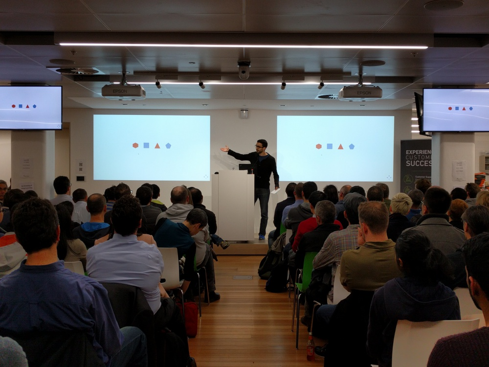
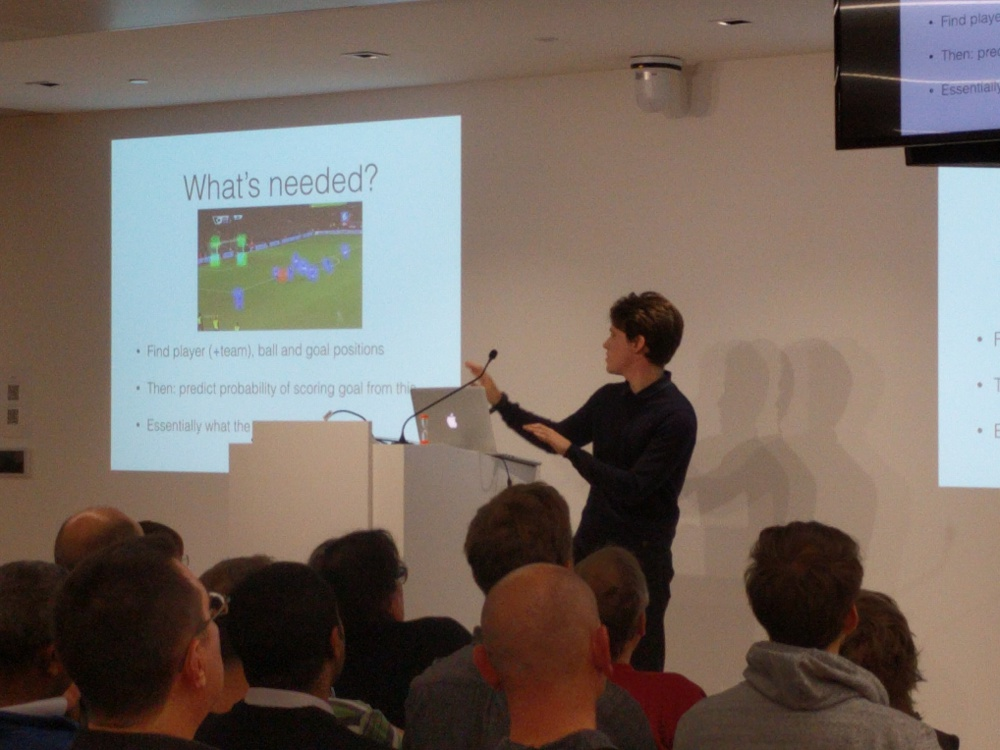
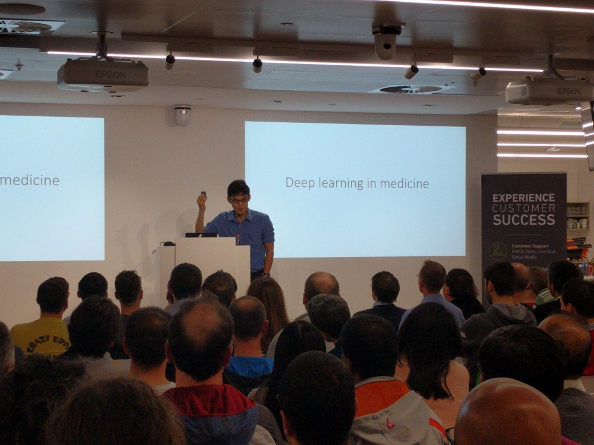
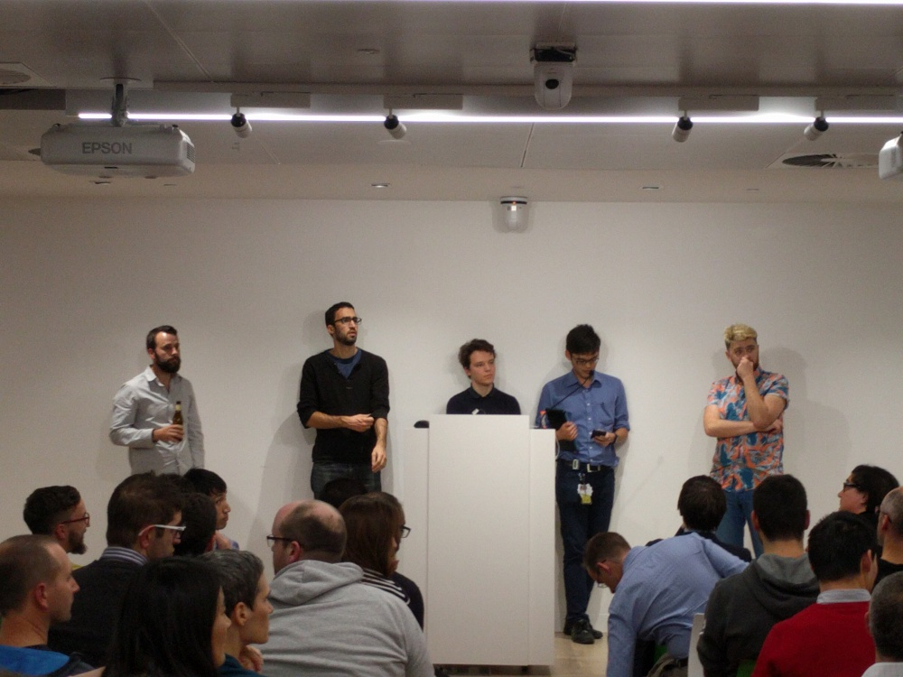
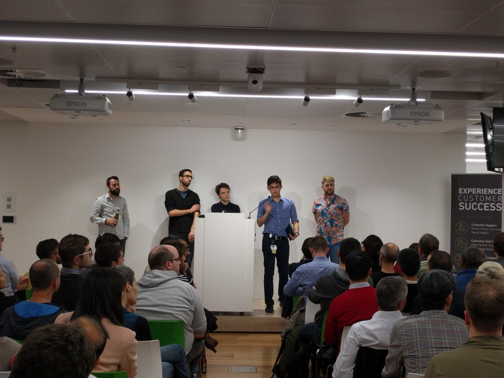
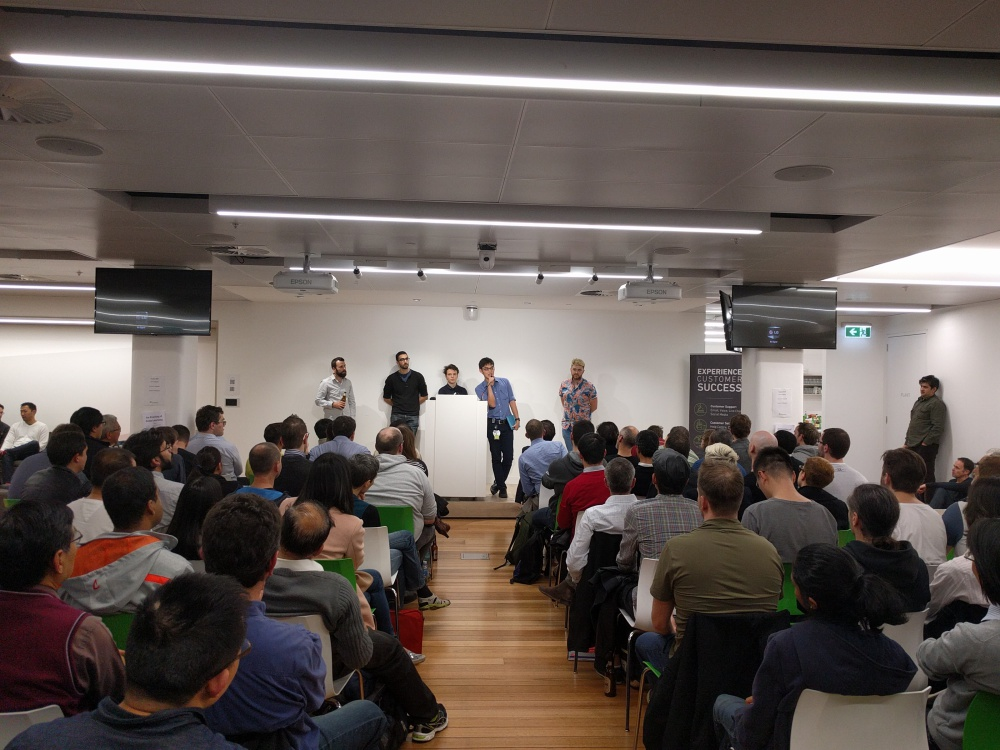
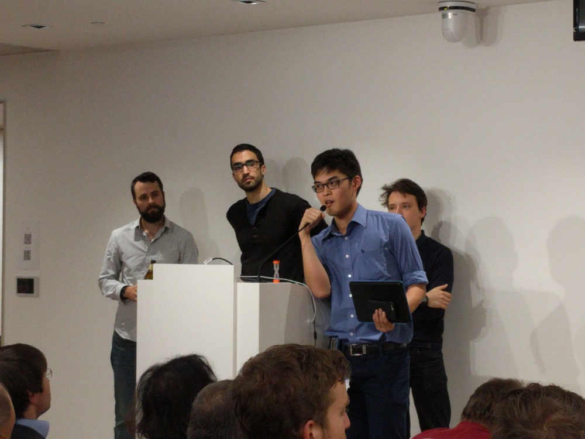
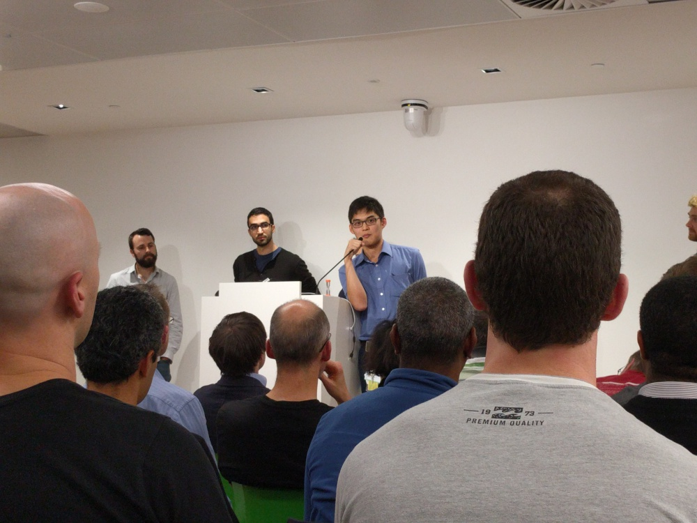

<!-- /img/blog/deep-learning -->

We're excited to announce an event on the 10th of June, featuring
NVIDIA, who will be speaking about their [DGX-01](http://www.nvidia.com/object/deep-learning-system.html) Deep Learning supercomputer, and a few
AI researchers who will be takling about applications of
Deep Learning.

<!--more-->

Details can be found here:

- [An evening of Deep learning with NVIDIA](https://www.eventbrite.com.au/e/silverpond-presents-an-evening-of-deep-learning-with-nvidia-tickets-25531975827).

Here are some photos from the event!

