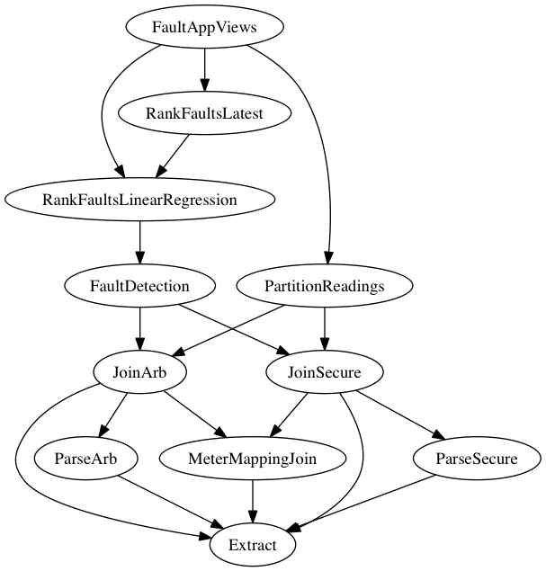

	<em>
		<a href="https://www.flickr.com/photos/usnavyresearch/">Office of Naval Research</a> -
		<a href="https://www.flickr.com/photos/usnavyresearch/10855637924/in/photolist-hxgYX7-gcmAL3-akcq1H-gcmB2d-hxh1G9-dLtGXz-e9ZSxG-gcmYbe-f7siwc-dLPvSZ-iiAwWZ-gcmo11-e9UcYp-gPScC-gvhXkD-e9ZSXm-gcmAFo-e9ZSBb-i45ou3-gny4n4-edT3He-dMkeQY-e9ZTf9-dMuBcy-e9ZSDu-oBSiJs-gcmAQb-fZDLcL-e9ZSyj-e9ZTjN-aXbgBH-e9UcKa-gV5rHn-e9UcWz-i45Uhr-dKxJnp-e9ZT1q-e9UcG2-gnCLCd-9uX91Z-4CNgZu-kwvnJB-gcmge6-e9UcKM-dHwRhu-e9UcPv-e9UdpV-gkUDUH-e9ZSMS-e9ZSLC">"120630-N-PO203-241"</a>
	</em>

On Thursday 8th, September 2016 I gave a talk on [Powercor's](https://www.powercor.com.au/) data-science platform at the
[AGL-Office Melbourne Data-Science Meetup](https://www.meetup.com/Data-Science-Melbourne/events/230763753/).
The talk briefly covered how the architecture of the platform was conceived and how
the platform was implemented.
Below is an excerpt from my talk to give some insight into building a platform
that can handle the rigour of data modelling and analysis.

<!--more-->

My presentation was the last section of a three-part presentation by some of the members
of the team at PowerCor that helped put together the data-science platform, research,
design, and implementations. The other speakers were Peter McTaggart and Adel Foda
with an introduction by Jonathan Chang.

---

## Building a Data Science Platform - The Process

### <em> Problems → Think → Enlightenment → Build → Solution </em>

## Problems

If you aim to build a data-science platform you are primarily motivated
to enable and facilitate _doing data science_. This generally means
that you want to be able to run models and perform analysis over
your organisation's data at scale and at speed. Although scale and speed
are the constraints that immediately jump out, they are by no means the
only factors that will determine the success of such a platform.
All of the following will be critical to the construction, uptake,
maintenance, operation, and further development of a data-science
platform:

* Reproducibility
* Scalability
* Historicity
* Interoperability
* Portability
* Longevity
* Comprehensibility
* Tractability
* Sensitivity

Why are these aspects significant?

They can be thought of as requirements. Without each one a platform
is untenable.

	
	<em>Jonathan Chang - About to introduce the speakers...</em>

## Think

### <em> Factoring and Reduction of Problems </em>

Although the requirements as stated are all individually important,
they are not orthogonal. There are various factors for
success that can be tackled individually that should allow all
of the requirements to be addressed. After enough navel-gazing,
these principles emerge:

* Encapsulation
* Idempotency / Repeatability
* Purity
* Compositionality

## Enlightenment

### <em> Build Systems ~ Functions </em>

	
	<em>Presentation Audience</em>

The conclusion we can draw from these factored requirements is that
we essentially want a build-system. If you're familiar with `make`
then you'll know what I'm talking about. On top of this, the system
should be as simple as possible - Ideally being able to be conceptually
represented with a pure function:

> result = function( arguments )

There are several arguments that are common for all models running on the platform:

> report = build( data-collected-to-date, date-range-of-query, ...)

With the additional argument being model-specific. For example:

> field-inspection-priorities = rank-faults( data, 2014-2015, threshold → 1ohm )

With this concept at the heart of our platform, compositionality becomes
the enabling factor of construction and reuse.

With such a methodology at play, many of the traditional pain-points
such as synchronization-issues, difficulties running reports over
"new-historical" data, caching, work-distribution, and validation
simplify greatly, or evaporate entirely.

	
	<em>Peter McTaggart - Opening the presentation...</em>

## Solution

A solution obviously doesn't exist in a purely conceptual space however,
and there is a lot of work required to actually engineer the architecture
that enables such theoretical principles. At Powercor we adopted
a layered-architecture to provide different "contexts" for implementation
of the platform:

* Environment
* System
* Controller
* Pipeline
* Task
* Cluster
* Boundary
* Process

This not-only provided clarity surrounding what each piece of development
was mandated to interact with, but also leveraged the expertise and roles
within the team so that each individual could focus on their own work
and trust that the boundaries were codified with enough rigour that
their work and the work of their colleagues would play nicely together.
Thus the roles of data-scientist, infrastructure-engineer, platform-engineer,
tester, and tech-lead were kept as focused and clearly-defined as possible.

The components that allowed us to build such contextual layers looked like the following:

<table>
	<tr class="odd"> <td align="right">Cloud Platform</td> <td align="left"><a href="https://aws.amazon.com">AWS</a></td> </tr>
	<tr class="even"> <td align="right">Data Storage</td> <td align="left"><a href= "https://aws.amazon.com/documentation/s3">AWS S3</a></td> </tr>
	<tr class="odd"> <td align="right">Data-Event Propagation</td> <td align="left"><a href="https://aws.amazon.com/sqs">AWS SQS</a> / <a href="http://kafka.apache.org">Apache Kafka</a></td> </tr>
	<tr class="even"> <td align="right">Distributed Computation</td> <td align="left"><a href="http://spark.apache.org">Apache Spark</a> / <a href="https://aws.amazon.com/elasticmapreduce">AWS EMR</a></td> </tr>
	<tr class="odd"> <td align="right">SQL Data-Query Interface</td> <td align="left"><a href="https://drill.apache.org">Apache Drill</a></td> </tr>
	<tr class="even"> <td align="right">Container Execution</td> <td align="left"><a href="https://docs.docker.com">Docker</a> / <a href="https://docs.docker.com/swarm">Docker-Swarm</a></td> </tr>
	<tr class="odd"> <td align="right">Data Dependency Resolution</td> <td align="left"><a href= "http://luigi.readthedocs.io/en/stable/">Luigi</a></td> </tr>
	<tr class="even"> <td align="right">Interactive Exploratory Environment</td> <td align="left"><a href= "https://zeppelin.apache.org">Zeppelin</a></td> </tr>
	<tr class="odd"> <td align="right">Metadata Storage</td> <td align="left"><a href= "https://www.postgresql.org">Postgres</a></td> </tr>
	<tr class="even"> <td align="right">Infrastructure Automation</td> <td align="left"><a href="https://www.ansible.com">Ansible</a></td> </tr>
	<tr class="odd"> <td align="right">Version Control</td> <td align="left"><a href= "https://bitbucket.org/">BitBucket</a></td> </tr>
	<tr class="even"> <td align="right">Internal Applications</td> <td align="left">Internal</td> </tr>
</table>

## Illuminated

The project was a successful collaboration between Powercor, Silverpond, and Peter,
to create a new platform for a powerful data science capability within the business.
This result was achieved in a short timespan and with Powercor's data, enabled
deeper understandings than were previously within reach.

Thanks to [Powercor](https://www.powercor.com.au/) and Peter for the opportunity to share our collaboration, as
well as [Data Science Melbourne](http://www.meetup.com/Data-Science-Melbourne/) and [AGL](https://www.agl.com.au/about-agl) for hosting a fantastic event.

