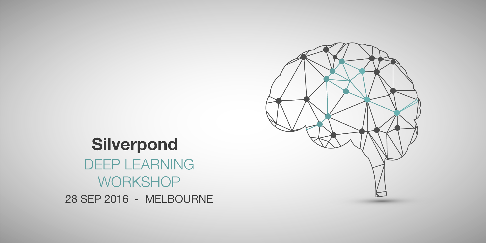

<!-- /img/blog/ -->

Note: This event has already run. See <a href="/workshops">our workshops page</a>
for upcoming events.

Want to learn deep learning? Join our [4-hour introductory workshop on Wed 28 Sep](https://www.eventbrite.com/e/deep-learning-workshop-tickets-4397376672) that will guide you through the underlying theory and maths, and get you building your first model neural network in TensorFlow.

<!--more-->

If you have basic Python skills and don’t mind maths, this hands-on workshop
will give you the basic knowledge you need to start your first deep learning
project.

Be warned – this is not a superficial overview like other courses out there –
expect to get your hands dirty in math, Python and TensorFlow.

Outcomes:

* An intuitive understanding of the components of machine learning systems
* Experience building neural networks in TensorFlow
* Practice in representation learning and word embeddings

**When:**
2 – 6PM WED 28 SEP 2016

**Where:**
SILVERPOND OFFICE
Level 1, 382 Little Collins Street
Melbourne, Australia

**How much:**
$250 + GST

> **For more details and registration:**
> [Deep Learning Workshop 28 Sep 2016](https://www.eventbrite.com/e/deep-learning-workshop-tickets-4397376672)

Finally, as we love our community, we will be offering a free preview workshop
to members of the [Melbourne Machine Learning and AI
Meetup](http://www.meetup.com/Machine-Learning-AI-Meetup/) on Wed 21 Sep. 

We look forward to seeing you there!
