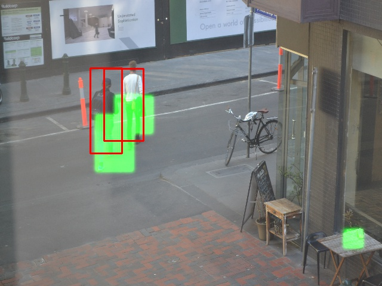

<!-- /img/blog/object-detection -->

If you’ve had the fortune to bump into to any of us here are Silverpond, you’ll
know that in addition to being generally geeky, we’re kind of into deep
learning.  It should be no surprise then that when a couple of us found
ourselves with some free time on our hands, we decided to combine some of the
various bits of hardware we had lying around the office with our love of deep
learning to create something cool.

<!--more-->

And this is what we came up with, [a little system that will take photos of the
office and count the number of people it can see](https://s3-ap-southeast-2.amazonaws.com/silverpondphotobot.silverpond.com.au/output/index.html):

  <h2 style="text-align: center;">Glorious iFrame</h2>
  <iframe src="http://s3-ap-southeast-2.amazonaws.com/silverpondphotobot.silverpond.com.au/output/index.html"></iframe>

 

The setup is reasonably simple, a Raspberry Pi takes a photo of the office
through a digital SLR and uploads it to a bucket on AWS S3.  Once a day, we
wake an EC2 instance which processes all of the uploaded photos and does the
heavy lifting of locating the people in the photo.

<!--
digraph {
  rankdir="LR";
  camera_bot -> s3_inbox -> person_detection_model -> s3_outbox;
}
-->

The first step was to get the Pi talking to the digital SLR.  While there are a
number of open-source tools available which will allow you to do this, we
instead used some software we had previously developed to get around some of
the performance and stability issues we had encountered with the open-source
tools.  From there we simply used the AWS CLI tools to upload the captured
image into S3.

We didn’t particularly want to have an EC2 instance running constantly doing
very little but processing the odd image every now and then, so we had a quick
look for other options.  At first glance it seemed that AWS Lambda would be
perfect for this little task; we have the Lambda triggered whenever a file was
uploaded into S3 and not have to worry about servers at all.  Unfortunately and
understandably there are some reasonably tight resource restrictions on AWS
Lambda, which made this infeasible.  The big one for us was the limit of 50MB
in a deployment package; deep learning requires a hefty set of supporting
libraries, and TensorFlow by itself easily pushes your package into the
hundreds of MB.

So, as tempting as it was to jump down this rabbit hole and start looking at
the various ways we could trim things back (we have previously had success
running deep learning models on low-spec devices), we instead decided to go
with a more traditional approach and use a normal EC2 instance which we would
simply spin up when required.  This is achieved through a small Lambda function
which is triggered daily through a CloudWatch scheduled event to start the
stopped instance.  The server itself has a cron job configured to run on reboot
that will download all the images, process them, upload the results and then
turn itself off.

This is a reasonably simple pipeline but it would be straightforward to turn
this into a more scalable system that could handle a considerable number of
images.  One approach would be to place the images onto a distributed queue
service such as SQS; if we detect that the queue is not draining quickly
enough, worker servers could be automatically launched to assist with the
processing, scaling back down again once the load drops off.

### Deep Learning

Now that we had the basic supporting infrastructure in place, it was time to
have a look at the deep learning side of things.  Recently image processing has
become a massively improved area of machine learning thanks to the publication
of, and ongoing improvements to Google’s “inception” convolutional neural
network.  Through some data wizardry we can take this existing work and bend it
to perform different tasks; in this case we wanted it to locate pedestrians in
the photo.  A little additional decoration was added via a bounding box
outlining the areas the model thinks belongs to a “human”.

Once we had this magic up and running, it was simply a matter of plugging it
into our simple AWS pipeline and viola, a pedestrian detector.

<strong>→</strong>

While we put together this little demo in a couple of days, we think it does a
great job of demonstrating some of the capabilities of deep learning.

### Object Detection Use-Cases and Implications

Some immediate use-cases for this demo could include:

* Counting Pedestrian Traffic
* Targeted Advertising
* Customer Behaviour Analysis
* Actuarial Metrics
* Event Operations

While previously this would have required several computer-vision PHDs
with specialised skill for an unbounded amount of time, deep-learning has
allowed us to train this targeted model to achieve our desired results
requiring only the help of a couple of deep-learning specialists, in a short
time-frame with no domain skill dependencies.

If you can think of a similar use-case (which shouldn't be hard) that your
business would benefit from then the solution is closer to your grasp than
it has ever been. If you'd like help getting started then Silverpond can get
you up and running very quickly.

Don't hesitate to <a href="mailto:info@silverpond.com.au">get in touch!</a>
