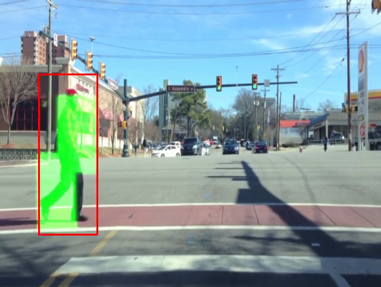
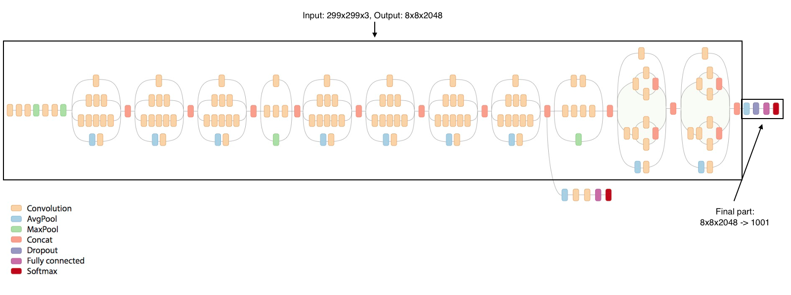
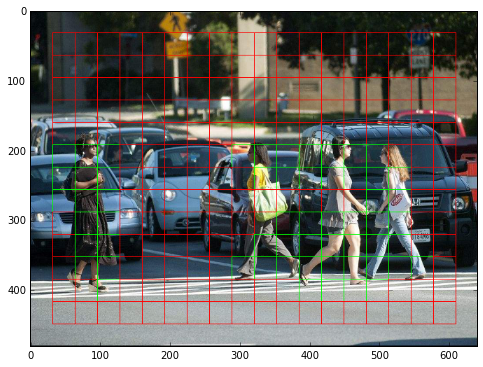
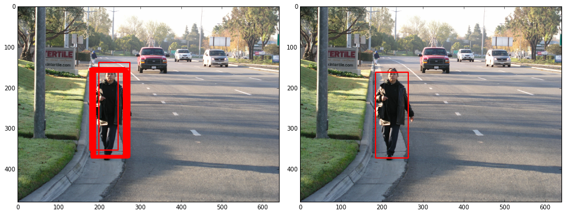

<!-- /img/blog/pedestrian-detection-details -->

_A detection from our model_

In an earlier post, Richard introduced our object detection demo and its underlying infrastructure. I'll now offer details on how we built the Inception based neural-network at the core of the system and how we went about making it learn to detect pedestrians.

## Motivation

At Silverpond, we found ourselves in need of a demo showing some of the capabilities of deep learning. We chose a pedestrian detector for the following reasons:

* It is a challenging detection problem: street scenes are very variable, with changing lighting, different clothing and different scales all posing potential problems. This is a great dataset to show off how well deep learning can work.
* Datasets are freely available: we used the [2D MOT 2015 Dataset](https://motchallenge.net/data/2D_MOT_2015/) and the [Caltech Pedestrian Dataset](https://www.vision.caltech.edu/Image_Datasets/CaltechPedestrians/).
* Pretrained deep learning image models are available, which are a great building block for an object detector. We used Google's [Inception v3 model](https://github.com/tensorflow/models/tree/master/inception).

This article is a high level overview of the ideas and methods we used to train our detector.

<!--more-->

## Building a pedestrian detector using Inception

Google's freely available Inception v3 model is a great object recognition model: given an image, it does an excellent job of telling what kind of object is in it. With a [top-5 error rate of 3.5%](https://arxiv.org/abs/1512.00567), it is famously "better than human" on the ImageNet challenge, which contains over 1.2M images of 1000 different classes -- Andrej Karpathy [only scored 5.1%](http://karpathy.github.io/2014/09/02/what-i-learned-from-competing-against-a-convnet-on-imagenet/).

Unfortunately, Inception doesn't solve pedestrian detection straight away. Here are the issues:

1. The ILSVRC 2012 dataset which Inception v3 is trained on has 1000 classes, but "pedestrian", or even "person", is not one of them.
2. Inception is a great image _classifier_, but it is not a _detector_: by default, it takes an image as input, and returns class probabilities, but it does not give any information about where in the image the object is located.

How do we get around these issues?

## Key Ideas

Taking a very high-level view, we can summarise the Inception v3 architecture shown above as follows:

* `299x299x3` input images
* Convolutions & max-pooling converting this image to an `8x8x2048` representation
* Average pooling to bring this to `1x1x2048`
* A fully-connected layer mapping this to `1001` output predictions: the class probabilities.

### Solving problem 1: No pedestrians in ImageNet

It turns out that the 1x1x2048 representation of the original image produced by going through inception is very powerful. In [a tutorial](https://www.tensorflow.org/versions/r0.9/how_tos/image_retraining/index.html), Google show how to replace the fully-connected logit layer with custom labels to allow you to predict different classes from the ones in ImageNet. Even though only the very last fully-connected layer is retrained, the 1x1x2048 features do a good job on a variety of classes.

This addresses our first problem: by replacing the final layer, we could use inception to predict whether an image contains a pedestrian or not. But it does not help us to localise the pedestrians: we can only predict the image as a whole. We need a second idea.

### Solving problem 2: How to localise?

One way to localise pedestrians in images could be to evaluate the classifier on different crops of the image. This approach works, but it is very slow: we would have to run the big Inception model from start to finish on each crop.

The key insight towards using Inception to localise objects quickly lies in the final layers. As we saw, Inception actually produces an `8x8x2048` representation before using average pooling to bring this to `1x1x2048`. We can interpret the `8x8x2048` representation as a grid of features, breaking the image down into 8 horizontal and 8 vertical grid squares. Then, instead of mapping one 2048-dimensional vector to the class labels, we can use a 1x1 convolution to map each one of these vectors to a class label, giving us a prediction at the cell level.

The image below shows the resulting grid. The edges of the image are not covered: this is our attempt to take Inception's lack of padding in its convolutional layers into account. The grid cells predicting pedestrians with a probability greater than `0.5` are drawn in green.

You will notice the image is bigger than 299x299. This is a nice property of the Inception architecture: as it is fully convolutional, it can be fed with any size of input image. In our case, we used `640x480` as an input, which produces the `13x18x2048` feature grid shown.

## Adding bounding boxes

This is a major step forward: rather than predictions for the entire image only, we can get predictions at the grid level. We could have stopped here, but we wanted to go one step further: could we produce accurate bounding boxes for the predictions?

The bounding box predictor also takes the `13x18x2048` grid as input, but instead of predicting a class probability at each cell, it predicts four numbers: the dimensions of the bounding box of the object under its grid cell. Training then works as follows:

* For each cell, predict the four numbers (distance to top, distance to left, distance to right, distance to bottom).
* If there is an object under the current cell, calculate the error as the difference between the true dimensions and the predicted dimensions (using an L1 loss)
* If there is no object under the current cell, ignore the output.

With the bounding box regressor trained, we can then run the entire model as follows:

* Calculate the class predictions for each cell, as well as the bounding boxes.
* Keep the bounding box predictions for detections more probable than a threshold (e.g. `90%`).

This produces a bounding box prediction for each active cell. Lots of these will belong to the same object (see e.g. the grid image: each pedestrian lights up several grid cells, each one of which will predict a bounding box). Hence, as a last step, we group these boxes using non-maximum suppression. The algorithm which worked best for us was [this one](http://www.pyimagesearch.com/2014/11/17/non-maximum-suppression-object-detection-python/). The example below shows the bounding boxes before grouping on the left, and after grouping on the right.

## Conclusion

By adapting Inception v3, we have been able to build a state-of-the-art pedestrian detector in a short space of time. This pedestrian detector can be of commercial use in several ways:

* Counting the number of people entering, say, a store over time, and determining where in the store they are spending most time
* As a step towards understanding demographics: how many people have been seen by gender, age, and any other quality of interest

In addition, the pipeline we built to make this detector is completely general, which means that, in principle, any object of interest could be detected, not just pedestrians. Given the abundance and low cost of video cameras, we are excited about the potential of applying object detection to extracting meaningful information from video.

=======
