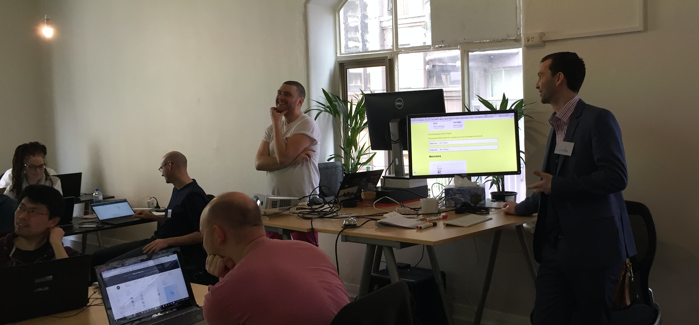

Our first [deep-learning workshop](/workshops) was a long time coming.
We ran several previews as well as spending a great deal of time developing and
refining the workshop content. But as they say,
"No Battle Plan Survives Contact With the Enemy."

... Or friends in this case!

<!--more-->

Our attendees came from all walks; students, professionals, experienced
data-scientists in industry and newcomers to the concepts involved.
All were eager to discover more about [deep-learning](/deeplearning) and
ways to apply it in their day-to-day work.

We got off to a great start, working through preliminary materials giving background
knowledge of the concepts involved and establishing the pattern of introduction,
then interactive experimentation with the ideas.

As we moved on we began exploring more advanced concepts such as embedding and
representation learning via interaction with the recently [open-sourced DeepScite project](/2016/09/22/DeepScite-Open-Sourced.html).

We received great feedback from attendees, one piece of which was the desire to
spend more time on the content and exercises. In response to this, we're
extending the duration of our next workshop. Instead of four hours, we'll be
running the workshop for 7 hours, including one hour for lunch to give everyone
ample time to exchange deep learning inspiration. 

We've also taken the opportunity to polish the flow of the content to ensure
that all the concepts covered tie seamlessly into each other over the course of
the day.

We wrapped up the workshop with a call-to-action, asking our attendees to
apply the concepts learned to personal or professional projects and return
for a show-and-tell session in the near-future. We'd love to see that
the knowledge imparted is more than just a curiosity and has a real impact
for the attendees!

Our **next workshop is running in November**, so come along
and join our new full-day [Deep Learning Workshop](/workshops)! 
