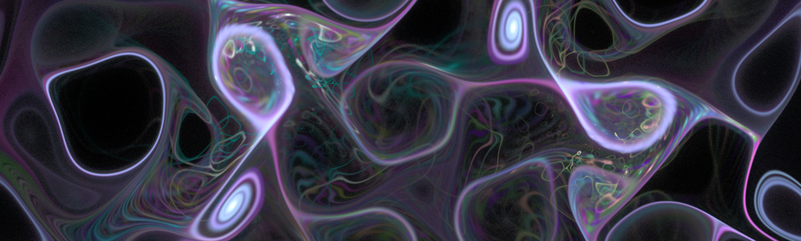
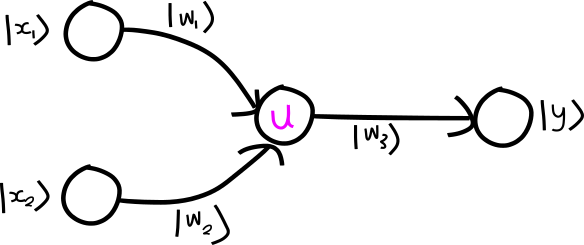
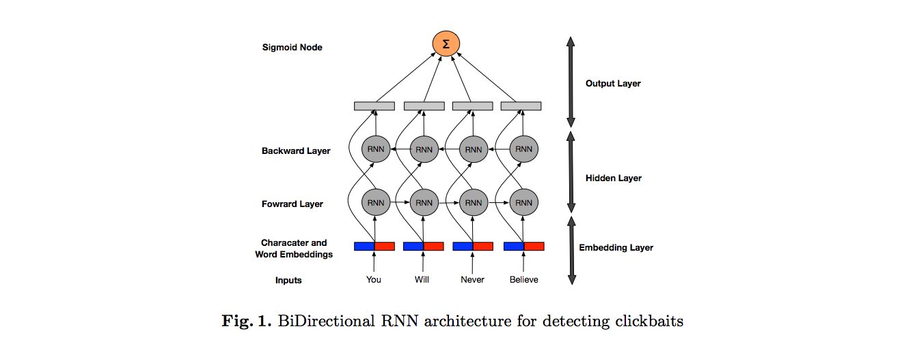
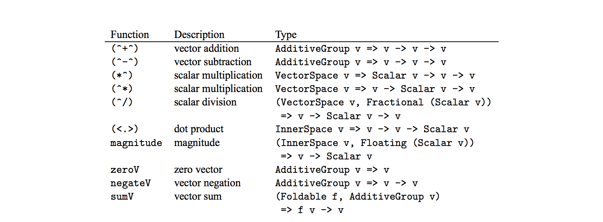

<!-- /img/blog/2016-12-industry-news -->

  <em>
    <a href="https://www.flickr.com/photos/manitobamaps/2661597665/in/photolist-7LHxe7-9ErPSC-7LHxab-7LDzTa-dESsxF-koPvau-i5ZGnc-jZpRo2-eYvLFz-4qwYo2-eYvFAt-eYvxXi-99xoge-5NLFbS-9a6NRo-eYH11f-7sbEaf-4icKQ-9nzv3K-54cofV-7s7d6H-7sbLPE-7seXCS-7sbJ1q-7s9WNm-7qAZ4x-7s7Jqe-7s7Hhi-7s7D66-7sbKnu-7seXeJ-7s62KM-7s7EpK-7sbc9Q-7s61p2-eYGSL5-8VekGo-4fRmaS-4ozZwX-7BVqZ1-eYErjm-4TXUgA-AUeWa-7BVrnS-7BREuR-7vzAau-7BREnF-oStFw-wzAW19-kD64Pp">Quantum foam</a>
    - <a href="https://www.flickr.com/photos/control9/">Alex Sukontsev</a>
  </em>

 

Here's a collection of some recent machine-learning, artificial-intelligence
and software-engineering papers, posts, and press-releases that have caught our attention.
As always, if some of these posts weren't written recently, then they were at least
recently discovered by us!

_Note: Updates to this post are still happening as December isn't over yet :)_

<!--more-->

### [Quantum neural networks](https://silky.github.io/posts/2016-12-11-quantum-neural-networks.html)

_<https://silky.github.io/posts/2016-12-11-quantum-neural-networks.html>_

If you're looking hear about some recent papers on quantum machine learning then you've
come to the right place! Noon covers three recent papers in this post that combine
the two very cutting edge areas of research:

* Quantum generalisation of feedforward neural networks by Wan, Dahlsten, Kristjánsson, Gardner and Kim.
* Quantum gradient descent and Newton’s method for constrained polynomial optimization by Rebentrost, Schuld, Petruccione and Lloyd,
* Quantum autoencoders for efficient compression of quantum data by Romero, Olson and Aspuru-Guzik,

Although this may sound like a double-niche area of research, both areas are very
active right now, and the benefits of combining the two could be huge.

 

### [We used Neural Networks to Detect Clickbaits: You won't believe what happened Next!](https://arxiv.org/abs/1612.01340)

_<https://arxiv.org/abs/1612.01340>_

The abstract says it best:

> Online content publishers often use catchy headlines for their articles in
> order to attract users to their websites...  Here, we introduce a
> neural network architecture based on Recurrent Neural Networks for detecting
> clickbaits. Our model relies on distributed word representations learned from a
> large unannotated corpora, and character embeddings learned via Convolutional
> Neural Networks...

Results are very good!

 

### [Learn Physics by Programming in Haskell](https://arxiv.org/abs/1412.4880)

_<https://arxiv.org/abs/1412.4880>_

In the vein of, and building on many if the ideas in
[Structure and Interpretation of Classical Mechanics](https://mitpress.mit.edu/sites/default/files/titles/content/sicm/book.html),
"Learn Physics by Programming in Haskell" builds up many Newtonian-physics principles
and primitives in the [Haskell](http://haskell.org/) programming language.
This is not intended for physicists, or for Haskell programmers, but for beginners
in both fields, as a duality to increase an understanding of both! So... if you have
Newtonian-mechanics and Haskell on your TO-LEARN list, then you've certainly
stumbled across a local-maximum here.

