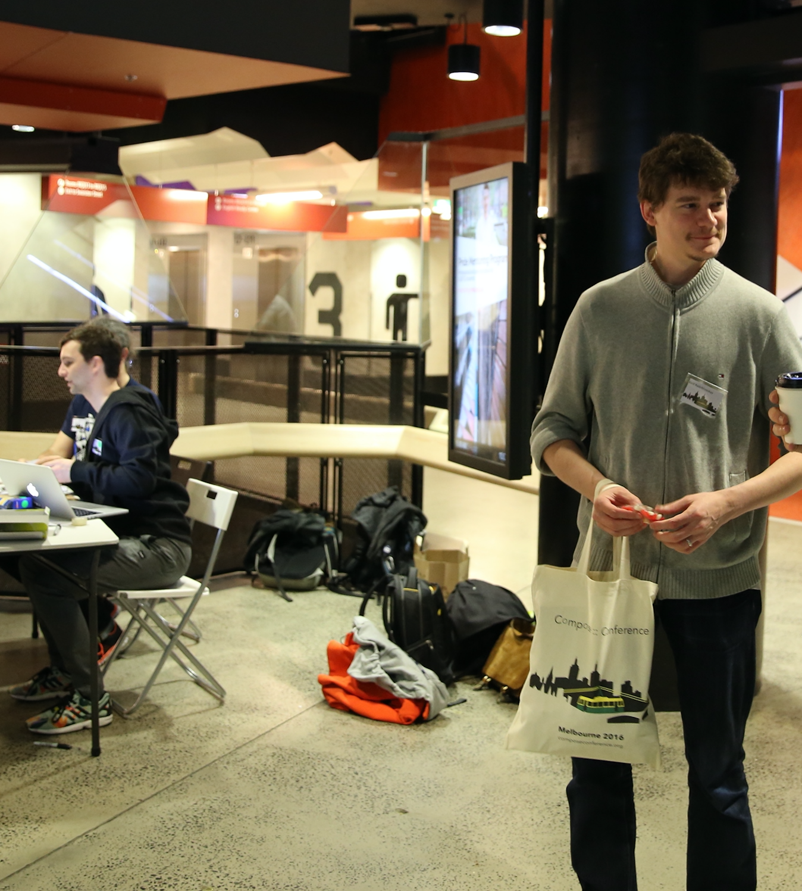

Silverpond made an appearance at
[Compose :: Melbourne](http://www.composeconference.org/)
on Monday and Tuesday this week.
Noon, Andy and I helped organise the event and other Silverponders came
along on the day to watch.

We have a great interest in functional-programming, so we want to see the
Melbourne community grow and flourish. Compose :: Melbourne was conceived
with this idea in mind. The turnout was fantastic and we all had a great
time.

We also took some pictures!

<!--more-->

Early in the morning before the day started...

And then in full swing!

At reception.

Opening the proceedings.

Watching the keynote.

Introducing the speakers.

Hanging out.

Hustling.

Handing out swag.

And relaxing after the event!
