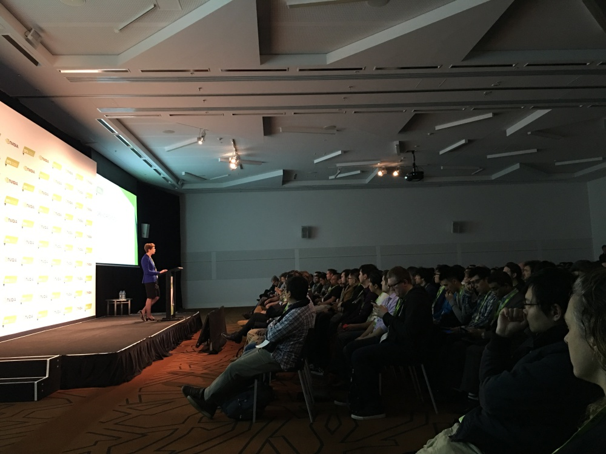
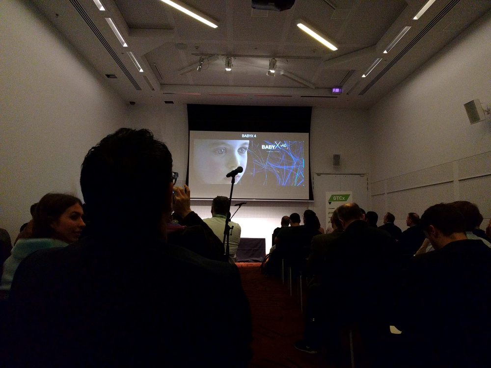
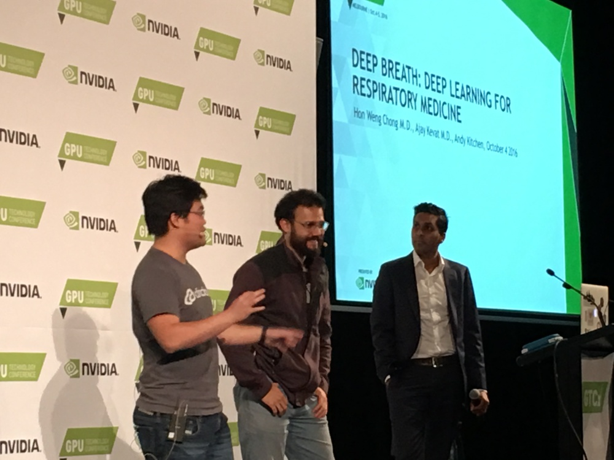
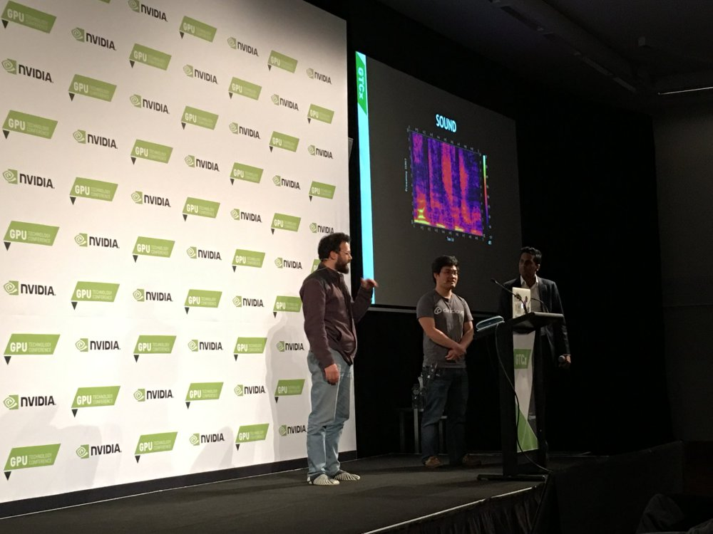

<!--more-->

In many ways, the recent neural-network renaissance in the form of
<a href="http://silverpond.com.au/deeplearning" target="_blank">deep-learning</a> has been more about hardware than software.
The advent of GPU-trained neural-networks has been described as a Big-Bang which manifested as a
remarkable double-digit improvement in performance on benchmarks and departure from convergence
on a sub-human-level-performance to a renewed linear improvement regime. <a href="http://www.nvidia.com" target="_blank">Nvidia</a>
was at the forefront of this renaissance with the wonderful applicability of their GPUs to this domain.
Rather than pat themselves on the back, they have embraced the application by focusing on deep-learning as a new
market and fostering the ecosystem and community by running events such as GTCx.

A great diversity of speakers have chosen to make an appearance at the
<a href="https://www.gputechconf.com.au" target="_blank">Melbourne GTCx</a> event in the
areas of Deep-Learning, Hardware and Virtual-Reality. Our own Andy Kitchen was amongst them.
Yesterday, Andy joined Clinicloud CTO Dr. Hon Weng Chong and Dr. Ajay Kevat of
Monash Children’s Hospital to share insights from
our deep-learning collaboration with <a href="https://clinicloud.com" target="_blank">Clinicloud</a>.
They demonstrated how the current state-of-the-art
is being applied to respiratory medicine, showcasing deep-learning beyond the usual technology-centric focus,
in its role in advancing important fields such as healthcare.

Deep-learning is growing quickly. It is easy to sit back and observe natural
industry adoption, however we join Nvidia in our desire to see the ideas from
deep-learning spread and cross-pollinated so that we can all reap the benefits
of the long overdue resurgance of AI. To this end, Nvidia's GTCx in Melbourne
was a great event and we look forward to the next one.

Kicking off GTCx in Melbourne

<a href="http://www.abi.auckland.ac.nz/en/about/our-research/animate-technologies.html" target="_blank">BabyX</a>
demonstration of virtual infant by University of Auckland

Dr Hon Weng Chong, Dr Ajay Kevat and Andy Kitchen on DeepBreath: Deep Learning in Respiratory Medicine

Applying convolutional neural networks to respiratory audio data
