Here at Silverpond we love our [functional programming](https://en.wikipedia.org/wiki/Functional_programming), so much so that we helped run a Melbourne functional programming conference, [Compose](http://www.composeconference.org/). So [Spark](http://spark.apache.org/) seemed like a natural fit for large, scalable batch processing jobs. Recently I worked with some of our resident data scientists on large-scale electrical meter data analysis.  My job was to write a harness to run a number of candidate models, written in Python. The models needed to run over all the smart meter data in the electricity network using [PySpark](http://spark.apache.org/docs/latest/api/python/index.html). PySpark is the [Python](https://www.python.org/) API to [Apache Spark](http://spark.apache.org/docs/latest/index.html).

<!--more-->

An issue I ran into fairly early on in our adventures in Spark land was data skew. The uneven distribution of workload that ensued made for inefficient clusters. Having tangled with this beast I came through the other side with my fair share of cuts and bruises. So am I now dusting myself off and ready to share some lessons learned. I’ll share how I identified the data skew to the two solutions I tried (repartitioning and bin packing) and finally their effects on processing times.

All the example code for this blog post can be found on github at [https://github.com/jsofra/bin-packing](https://github.com/jsofra/bin-packing).

Let’s start with the basics:

## What is Spark?

Spark is a general-purpose, distributed cluster computing engine. Spark is written in [Scala](www.scala-lang.org/) which means it inherits some of Scala's functional flavour, giving the API a nice feel right out of the box. This functional flavour is on display in Spark's central abstraction, the [Resilient Distributed Datasets (RDD)](http://spark.apache.org/docs/latest/programming-guide.html#resilient-distributed-datasets-rdds). RDD's are an immutable, partitioned, distributed data structure.


All distributed computation in Spark is done via **transformations** and **actions** over the RDD's. Transformations are operations on RDD's that return a new transformed RDD, such as *map*, *filter*, *flatMap* etc. Actions are operations that run a computation on the RDD and return some value to the driver program, such as *reduce*, *count*, *take* etc.

These operations should look familiar to anyone who has done some functional programming and their effect is, as you would expect. The Spark magic is that the transformations will automatically be distributed in parallel across the cluster, whilst the actions may aggregate values and return a final result.

## Uneven Distribution - Identifying Data Skew

The first time I realised that there may be uneven distribution of computation on the cluster was when I was reviewing the [Ganglia](http://ganglia.info/) metrics for my cluster (we were running [EMR](https://aws.amazon.com/emr/) clusters) and noticed a strange pattern in the memory usage.

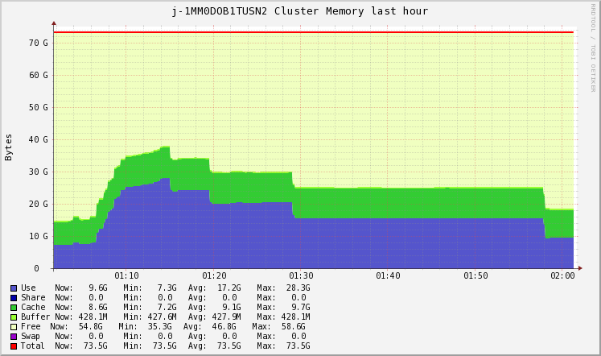

As can be seen in the Ganglia memory trace above, memory usage ramps up quickly at the start of the job run and then reduces in steps over time. As nodes in the cluster finish processing they release their memory and that is reflected in the trace. We can see that one node seems to be processing data long after all the other nodes have finished processing. This is confirmed by looking at the load traces for the individual nodes (see below), we can see the fist node continues to process load after all the other have completed.

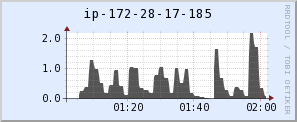 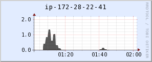 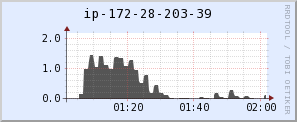 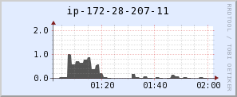

It was clear from this that we had an uneven distribution of work across the cluster; one node was doing all the heavy lifting whilst others did very little. This is obviously inefficient. There was unused capacity in the cluster that we should be able to harness.

So, why the uneven distribution of work? From looking at my code, it didn't seem to be an algorithmic issue. The core of the code was simple. It was mapping a function over each transformer in the electrical network. Implicitly I had assumed that Spark would do a good job of distributing that work. Spark partitions the data across the cluster and workers in each node are sent a mapping function (a task) to compute on their portion of the data. I thought this assumption still held true. I decided to have a look at the Spark UI to see what was going on with those workers.

The Spark UI allows you to look at the details of each processing stage. It shows detail information and metrics about the time taken to execute each individual task, amount of input data processed and the amount of output data produced. At the top of the page is a visual chart showing each of the tasks per executor, that looks like this:

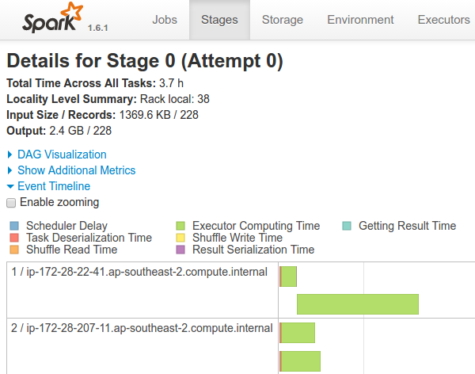

The task chart gives a good high level overview of what happened in the cluster. It allows you to quickly see if tasks were delayed or if there was excessive data shuffling, or deserialization happening. In my case none of these were an issue. If we zoom out to see the entire chart we can start to get an idea of what may be going on:

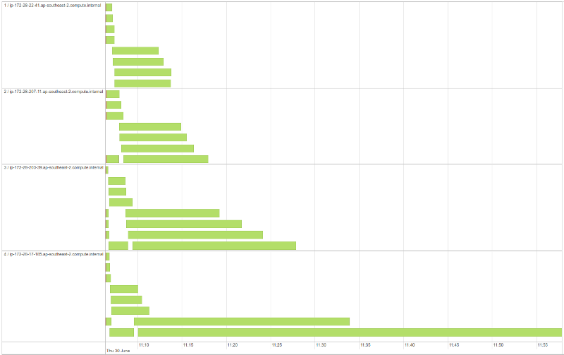

We can see that all tasks take varying amounts of time to complete, which is to be expected, but the variation is quite large. If we look the aggregated metrics for the executors (JVM instances that workers run on) we see that the executors have very varied output record sizes:

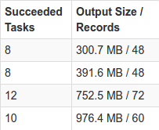


So maybe it was the data? Each node is doing more or less work not because of computation complexity but because of the amount of data they processed.

I realised the root of the problem: we were running the models across meter readings that were being grouped by transformer, on a per transformer basis.

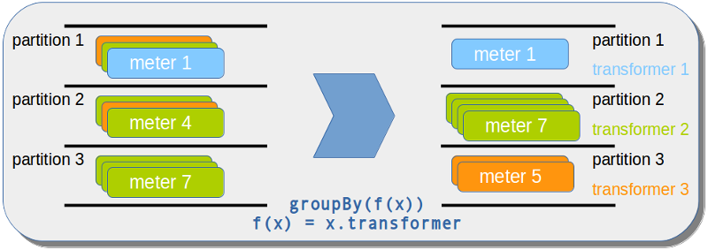

It so happened that the number of meters per transformer varied wildly, causing each task to process different amounts of data. We had a data skew problem due to the natural hierarchy in our data!

## Project Gutenberg Data Skew Example

In the rest of this post I will outline some techniques I used to addressed our data skew. I will provide a small example that is more easily digestible than the model we were running on the electrical network.

The example makes use of ebook text from the [Project Gutenberg](https://www.gutenberg.org/) collection. The ebooks are grouped using the [Gutenberg Bookshelves](https://www.gutenberg.org/w/index.php?title=Category:Bookshelf) (bookshelves are categories e.g. Adventure, Sci-Fi, Religious Texts etc) and frequency analysis is performed on these groups. In this way we are able produce a natural data skew since there is a wide variance in the number and size of the texts in each bookshelf.

The Frequency Analysis used is the very vanilla [Term Frequency - Inverse Document Frequency (TF-IDF)](https://en.wikipedia.org/wiki/Tf%E2%80%93idf).


Our aim is to search the Gutenberg texts in a couple of ways, given some search terms:

1. Find the text in each Gutenberg bookshelf that those terms are most important to.
2. Find the Gutenberg bookshelf that those terms are most important to.

The code in the example is written in [Clojure](http://clojure.org/) using the [Sparkling](http://gorillalabs.github.io/sparkling/) library, a Clojure API for Spark. This can be easily translated to any other language with Spark support. Clojure turned out to be a great way to work with Spark. It is functionally focused, has a great REPL for interactive development, and being on the JVM makes it much easier to deploy than Python.

## Fixing the Skew

So what can we do about data skew? When we look at data by partition we can identify heavily weighted partitions and that a number of the larger bookshelves are clumped together. We know that Spark assigns one task per partition and each worker can process one task at a time. This means the more partitions the greater potential parallelism, given enough hardware to support it.

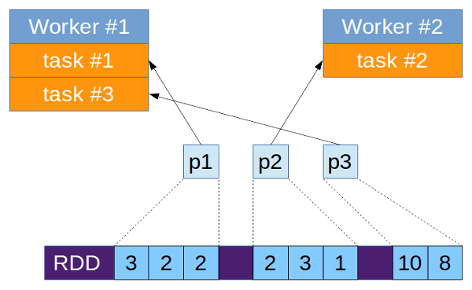

### Solution 1: Simply Partitioning

So can we simply partition our way out of this? What if we partition our data to the number of units of work we have? In our case we are performing the TF-IDF over each bookshelf so we can partition the data by the number of bookshelves, 228. That means there will be 228 tasks to be performed in parallel.

``` clojure
(spark/repartition 228 bookshelves)
```

Let's have a look at the Spark UI for this repartitioning and see how it compares to the previous skewed example, here is the zoomed out task chart (this is from the end of the run, the full task chart consisted of three pages):

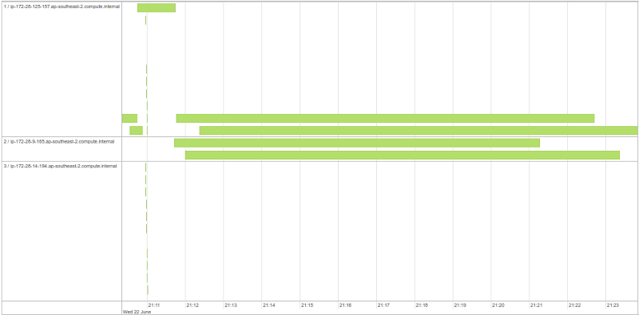

And here we can see the output record sizes are still somewhat unbalanced:

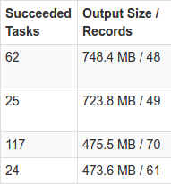

The partitioning did in fact improve the performance. In fact it improved it greatly. We went from ~55 mins to ~25 mins on the same hardware, but there was still a number of issues:

<ul>
<li>Overhead from small tasks
<ul>
<li>There are a number of very small tasks, there can be significant overhead in each Spark task.</li>
</ul>
</li>
<li>Poor scheduling
<ul>
<li>Since we have fewer workers than tasks, tasks will be scheduled across workers in the cluster. At the end of the process we can see a number of very large tasks were running. This is inefficient as better scheduling would have allowed for a number of smaller tasks to run in parallel to the larger tasks. We can still see unused capacity in the cluster, in fact we see that at the end of the run only 3 of the 4 executors are being utilised, the four has not been scheduled any further work.</li>
</ul>
</li>
<li>Not enough hardware
<ul>
<li>If we had more hardware we could increase the parallelism, which means more workers to process the tasks.</li>
</ul>
</li>
<li>Uneven distribution
<ul>
<li>From looking at the executor metrics we still saw significant imbalance in the output size of the records across the cluster.</li>
</ul>
</li>
</ul>

### Packing Problems

To my mind Spark doesn't have enough information about the shape of our data to know how to best schedule the tasks. But Spark does allow us to use our own custom partitioning scheme. Could we create more balanced computation across the workers and partition data into more evenly weighted chunks? If so we'd be less reliant on Spark's scheduling of tasks.

The problem roughly falls into a class of optimization problems known as [packing problems](https://en.wikipedia.org/wiki/Packing_problems). These are NP-hard problems so we need to make use of some kind of heuristical method when implementing a solution.

#### Solution 2: Bin-packing

Our problem seems most closely related to the [Bin Packing](https://en.wikipedia.org/wiki/Bin_packing_problem) problem (minimum number of bins of a certain volume) or maybe the [Multiprocessor Scheduling](https://en.wikipedia.org/wiki/Multiprocessor_scheduling) problem (pack into a specific number of bins). We will look at two Bin Packing methods:

1. First Fit (smallest number of fixed sized bins)
2. First Fit + Smallest Bin (fixed number of bins)

*Note:* These methods were chosen for their ease of implementation, the actual methods are somewhat orthogonal to solving this partitioning problem in Spark. We just need a way to create even partitions. Note also that these methods require the items being packed, to be sorted in descending order based on the weight given to each item. This may be prohibitive for certain applications if it requires shuffling of data around the cluster. In this case we use the number of books in a bookshelf as our weight and the book URLs as our data so it is inexpensive to calculate.

Let's look at some implementations for those two methods. First I define some helper functions to add an item to a bin, select the a bin that an item fits in to, and add a new bin:

``` clojure

(defn add-to-bin [bin [_ size :as item]]
  "Add an item to a bin."
  {:size (+ (:size bin) size)
   :items (conj (:items bin) item)})

(defn select-bin [bins [_ size] max-size]
  "Select the first bin that the item fits into."
  (letfn [(fits? [bin]
            (let [new-size (+ (:size bin) size)]
              (<= new-size max-size)))]
    (-> (keep-indexed (fn [i b] (when (fits? b) i)) bins)
        first)))

(defn grow-bins [bins item]
  "Grow the number of bins by one."
  (conj bins (add-to-bin {:size 0 :items []} item)))

```

#### First-Fit Packing

With first-fit packing we aim to create the smallest number of fixed-sized bins that the items fit into. We iteratively place items into the first bin that they will fit into until there are no items left. Thus:

<ol>
<li>start with a single empty bin</li>
<ul><li>maybe the size of the largest item</li></ul>
<li>for each item find the first bin that it will fit into and place it into the bin</li>
<li>if no bins will fit the item create a new bin to put it into to</li>
<li>continue until all items are exhausted</li>
</ol>

The code below shows this implemented in Clojure using a **reduce** over all the items, accumulating a list of bins, either fitting each item into an existing bin or creating a new bin.

``` clojure

(defn first-fit-pack
  "Simple first fit algorithm that grows bins once reaching max-size.
   Should give min required bins."
  [items max-size]
  (let [init-bins [{:size 0 :items []}]]
    (reduce (fn [bins item]
              (if-let [fit (select-bin bins item max-size)]
                (update-in bins [fit] #(add-to-bin % item))
                (grow-bins bins item)))
            init-bins items)))

(let [items [[:a 9] [:b 7] [:c 6] [:d 5] [:e 5] [:f 4] [:g 3] [:h 2] [:i 1]]]
  (assert
   (= (first-fit-pack items 9)
      [{:size 9 :items [[:a 9]]}
       {:size 9 :items [[:b 7] [:h 2]]}
       {:size 9 :items [[:c 6] [:g 3]]}
       {:size 9 :items [[:d 5] [:f 4]]}
       {:size 6 :items [[:e 5] [:i 1]]}])))

```

#### First-Fit + Smallest Bin Packing

First-fit works pretty well. But we're working in a hardware-constrained environment. To optimise code for the particular hardware it would be good to have a fixed number of bins instead of a fixed bin size. That way if we have 16 workers we can create 16 evenly-sized bins, one for each worker to process.

To achieve this I have slightly modified the first-fit process above. Instead of growing the number of bins when we have an item that will not fit we find the bin with the smallest number of items in it and we add the item to that bin. Thus, once all the bins are 'full' the rest of the items will simply get distributed one by one to the emptiest bin at the time. This only works because we are using a sorted list of items. The process is thus:

<ol>
<li>start with a single empty bin</li>
<ul><li>maybe the size of the largest item</li></ul>
<li>for each item find the first bin that it will fit into and place it into the bin</li>
<li>if no bins will fit the item add it to the bin that has the least in it</li>
<li>continue until all items are exhausted</li>
</ol>

The code below shows this implemented in Clojure, again using a **reduce** over all the items, but this time replacing the **grow-bin** function with the **add-to-smallest-bin** function.

``` clojure

(defn add-to-smallest-bin [n bins item]
  "Add the item to the smallest bin."
  (if (< (count bins) n)
    (grow-bins bins item)
    (update-in bins [(select-smallest-bin bins)]
               #(add-to-bin % item))))

(defn first-fit-smallest-bin-pack
  "Simple first fit algorithm that continues to add to the smallest bin
   once n bins have been filled to max-size."
  [items n max-size]
  (let [init-bins [{:size 0 :items []}]]
    (reduce (fn [bins item]
              (if-let [fit (select-bin bins item max-size)]
                (update-in bins [fit] #(add-to-bin % item))
                (add-to-smallest-bin n bins item)))
            init-bins items)))

(let [items [[:a 9] [:b 7] [:c 6] [:d 5] [:e 5] [:f 4] [:g 3] [:h 2] [:i 1]]]
  (assert
   (= (first-fit-smallest-bin-pack items 3 9)
      [{:size 14 :items [[:a 9] [:f 4] [:i 1]]}
       {:size 14 :items [[:b 7] [:e 5] [:h 2]]}
       {:size 14 :items [[:c 6] [:d 5] [:g 3]]}])))

```

### Spark Custom Partitioning

Spark allows for custom partitioning across clusters by implementing a [**Partitioner**](https://spark.apache.org/docs/1.6.1/api/java/org/apache/spark/Partitioner.html), which is an abstract class. You can only partition RDD's of key-value pairs. This is a special RDD in Spark where each item is a pair with both key and value. Two abstract methods of the **Partitioner** class must be implemented to describe the partitioning scheme, **getPartition** and **numPartitions**. The **numPartitions** method simply controls the number of partitions you wish to create (returning an integer), whereas **getPartition** does the work of mapping a key (from the key value pair) to a partition index (returning an integer). So for our partitioning scheme we would like to map an item key (url of bookshelf) to an index for a bin.

Let's look at the code for creating these indices:

``` clojure

(defn item-indices [bins]
  {:bin-count (count bins)
   :item-indices (into {}
                       (for [[idx bin] (map-indexed vector bins)
                             [k _] (:items bin)]
                         [k idx]))})

(let [items [[:a 9] [:b 7] [:c 6] [:d 5] [:e 5] [:f 4] [:g 3] [:h 2] [:i 1]]]
  (assert
   (= (-> items
          (bin-packing/first-fit-smallest-bin-pack items 9 3)
          bin-packing/item-indices)
          {:bin-count 3
           :item-indices {:e 1 :g 2 :c 2 :h 1 :b 1 :d 2 :f 0 :i 0 :a 0}})))

```

Ok so we now have a map of item keys to bin indices, **item-indices** and a count of the number of bins, **bin-count** - all we need to do now is create a **Partitioner** implementation and we can repartition our data. To create the **Partitioner** in Clojure we can use **proxy** to create an anonymous implementation of the abstract class. Maps, such at **item-indices** act as functions that take a key and return a value. Thus to implement **getPartition** the map can be passed through and the key applied to it. We return **bin-count** from **numPartitions** and we are done.

A complete bin packing repartitioning may look something like this:

``` clojure

(defn partitioner-fn [{:keys [bin-count item-indices]}]
  (su/log "Partitioning into" bin-count "partitions.")
  (proxy [Partitioner] []
    ;; get partition index
    (getPartition [key] (item-indices key))
    (numPartitions [] bin-count)))

(defn partition-into-bins [ebook-urls weight-fn]
  (let [ebook-urls    (spark/cache ebook-urls)
        packing-items (spark/collect
                       (su/map (fn [[k v]] [k (weight-fn v)])
                               ebook-urls))
        indices       (-> (sort-by second > packing-items)
                          (bin-packing/first-fit-smallest-bin-pack 16)
                          bin-packing/item-indices)]
    (spark/partition-by
     (partitioner-fn indices)
     ebook-urls)))

```

## Results

So how well did the bin packing scheme work on our Gutenberg dataset?

I ran the TF-IDF over the Gutenberg bookshelves on an [EMR](https://aws.amazon.com/emr/
) cluster with the follow configuration:

<ul>
<li>Master:</li>
<ul><li>m3.xlarge</li></ul>
<li>Core:</li>
<ul><li>4 x m3.xlarge</li></ul>
<li>CPUs:</li>
<ul><li>20 total</li></ul>
<li>Executors:</li>
<ul><li>4 (one per core)</li></ul>
<li>Workers:</li>
<ul><li>16 (4 per executor)</li></ul>
</ul>

On this EMR cluster I applied the TF-IDF algorithm using 3 different methods:

<ul>
<li><span style="color:red"><b>Our Starting Point (Skewed):</b></span> S3 data, without re-partitioning</li>
<ul><li>38 partitions</li></ul>
    <li><span style="color:red"><b>Solution 1 (Re-partitioned):</b></span> Maximally partitioned by number of bookshelves</li>
<ul><li>228 partitions</li></ul>
<li><span style="color:red"><b>Solution 2 (Bin-packed):</b></span> Re-partitioned using bin packing method</li>
<ul><li>16 partitions</li></ul>
</ul>

Using these three methods run times were as follows:

<ul>
<li><span style="color:red"><b>Our Starting Point (Skewed):</b></span></li>
<ul><li>~55 mins</li></ul>
<li><span style="color:red"><b>Solution 1 (Re-partitioned):</b></span></li>
<ul><li>~25 mins</li></ul>
<li><span style="color:red"><b>Solution 2 (Bin-packed):</b></span></li>
<ul><li>15 mins</li></ul>
</ul>

Using maximal partitioning on the Gutenberg data set shows a significant improvement and an even greater improvement when using the bin packing method. The bin packing method also has the most predictable run time. It was always 15 mins whereas the other methods fluctuated due to the unpredictable schedule of the different sized tasks. If we look at the Spark UI for a bin packed run we can see just how evenly the tasks were distributed:

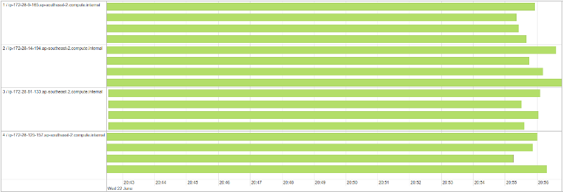

The output record sizes are also very even, with exactly 4 task per executor:

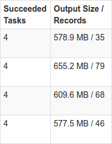


## Conclusions

Data skew in a distributed computation has the potential to cause massive inefficiencies. It is really important to consider how your data is partitioned across the cluster. You should aim to avoid shuffling data around nodes in the cluster. Under circumstances where you are suffering data skew, it may be more efficient to repartition your data prior to performing you computation. This should distribute work more evenly across the cluster and ensure better parallelism.

Bin packing can beat simple partitioning in limited-resource environments and is quite straightforward to implement. It may enable you to optimise the capacity of your cluster and allow you to use a smaller cluster. Bin packing may also make the computation's run time more predictable. Without bin packing Spark will unpredictably schedule tasks regardless of their size causing more variance in the overall run time.

All the example code for this blog post can be found on github at [https://github.com/jsofra/bin-packing](https://github.com/jsofra/bin-packing).

Do you have a data skew problem in your Spark setup? I’d be interested to hear how you dealt with it, please get in touch [@sofra](https://twitter.com/sofra).
