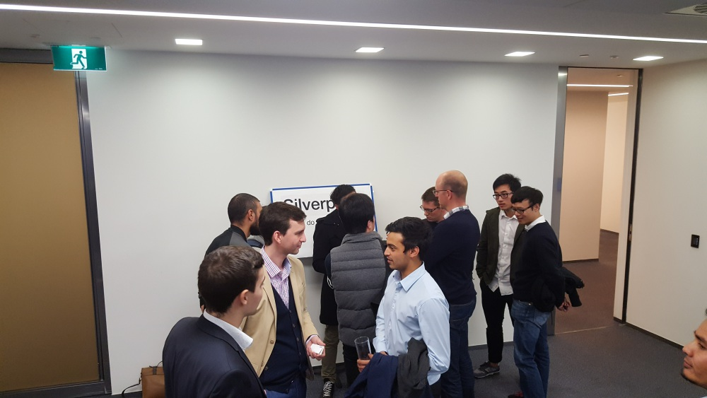

On Monday there was a huge turnout for the
["Data-Science Internship Evening"](https://www.meetup.com/Data-Science-Melbourne/events/232889835/)
event put on by Data-Science Melbourne at Deloitte.

More than 10 companies pitched to a group of over 500
interns about the opportunity to come and work with
them as part of an internship program facilitated
by the new internship startup [PrevYou](https://www.prevyou.com.au/).

<!--more-->

 

Jono and I represented the team this time. In our presentation, we
went with simplicity and authenticity. We gave the students a peek into 
Silverpond and our machine learning work visually, through photos of 
the many events we've run and contributed to.

 

 

There were roughly 10% undergraduates and 80% post-graduate students in
attendance from where I was sitting.
(Yuval estimated that there were about 30% undergrad and 70% post-graduates.)
This shows that there is a huge well of talent in our
city, earnestly looking to get a start in data-science!

Silverpond found that a great many of the attendees were very interested
in the applications of deep-learning in particular, as neural-networks are
going through a renaissance at the moment. We're very excited to see that
whatever happens in the near-future, there won't be a shortage of talent
to help out.
