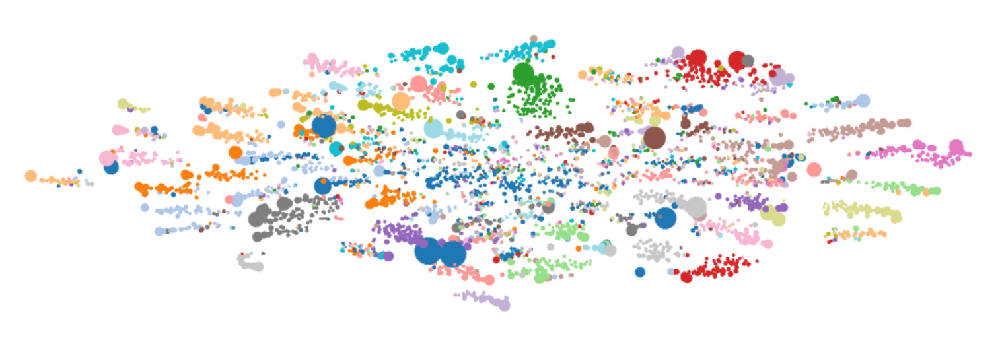
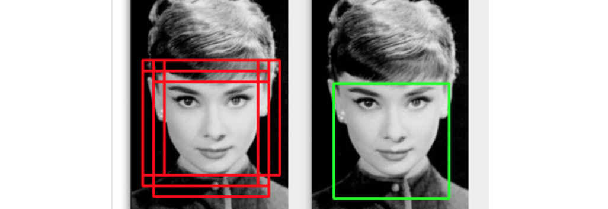

  <em>
    <a href="https://www.flickr.com/photos/manitobamaps/2661597665/in/photolist-7LHxe7-9ErPSC-7LHxab-7LDzTa-dESsxF-koPvau-i5ZGnc-jZpRo2-eYvLFz-4qwYo2-eYvFAt-eYvxXi-99xoge-5NLFbS-9a6NRo-eYH11f-7sbEaf-4icKQ-9nzv3K-54cofV-7s7d6H-7sbLPE-7seXCS-7sbJ1q-7s9WNm-7qAZ4x-7s7Jqe-7s7Hhi-7s7D66-7sbKnu-7seXeJ-7s62KM-7s7EpK-7sbc9Q-7s61p2-eYGSL5-8VekGo-4fRmaS-4ozZwX-7BVqZ1-eYErjm-4TXUgA-AUeWa-7BVrnS-7BREuR-7vzAau-7BREnF-oStFw-wzAW19-kD64Pp">Proposed Bunn's Creek Park (1973)</a>
    - <a href="https://www.flickr.com/photos/manitobamaps/">Wyman Laliberte</a>
  </em>

 

Here's a collection of some recent machine-learning, artificial-intelligence
and software-engineering papers, posts, and press-releases that have caught our attention.
If some of these posts weren't written recently, then they were at least
recently discovered by us!

<!--more-->
 

### [Rewrite: Neural Style Transfer For Chinese Fonts](https://github.com/ml-lab/Rewrite)

_<https://github.com/ml-lab/Rewrite>_

Rather than taking on the herculean challenge of fleshing out a design for
26,000 characters when creating a new Chinese-language font, why not let
deep-learning do the heavy lifting for you? That is the premise behind
"Rewrite" - a style transfer network that can learn a representation of the
"radical" concept from Chinese glyphs, deconstruct an example font into the
style of these radicals, then applying that style to the radicals of a
"universal" character set... In practice, you now only need to design a few
example characters in your new font, and the network extrapolates from these to
the remaining characters!

_... Shared by Noon_

### [MLDB: The Machine Learning Database](http://mldb.ai/)

_<http://mldb.ai/>_

> MLDB is an open-source database designed for machine learning. 
> You can install it wherever you want and send it commands over a RESTful API to 
> store data, explore it using SQL, then train machine learning models and expose them as APIs.

This might be just what's required to scale your training, inference, and
data-engineering from proof-of-concept to operational.

_... Shared by Noon_

### [Surpassing Gradient Descent Provably](https://scirate.com/arxiv/1611.00347)

_<https://scirate.com/arxiv/1611.00347>_

This paper introduces...

> the Double Incremental Aggregated Gradient method (DIAG)

A new optimization technique that surpasses traditional SGD algorithms,
not just experimentally, but provably.

> The iterates of the proposed DIAG method uses averages of both iterates and
> gradients in oppose to classic incremental methods that utilize gradient
> averages but do not utilize iterate averages.

The paper is very heavy on theory, but if the claims pan-out then you may
see DIAG appearing in the palette of "learning" options in the likes of
TensorFlow some time soon.

_... Shared by Noon_

### [DataEngConf](http://www.dataengconf.com/about)

_<http://www.dataengconf.com/about>_

> "DataEngConf is the first engineering conference that bridges the gap between
> data engineers and data scientists."

The conference looks to be well attended with many interesting speakers and
companies attending.

DataEngConf ran on November 3-4, 2016 in NYC.

_... Shared by Noon_

### [Progressive Neural Networks](https://arxiv.org/abs/1606.04671v3)

_<https://arxiv.org/abs/1606.04671v3>_

The word "progressive" here refers to a progression of "network" columns
where pre-learned features can be re-used by future network-iterations.
The architecture addresses the persistent issue that modern networks have
with "forgetting". The architecture is demonstrated on several Atari games
with network performance beating "single-column" style implementations.
It is unclear what the penalty for this multi-column architecture is in
terms of speed of inference and learning, but the convergence properties
certainly make it worthy of closer inspection.

_... Shared by Noon_

### [Law-Bot](https://www.lawbot.info/)

_<https://www.lawbot.info/>_

The idea behind law-bot was to bring quasi-legal advice to the masses through
an intelligent chat-bot. Sounds great! Unfortunately the execution at this
point leaves a lot to be desired with the bot defaulting to requests for
clarification and exhibiting regular displays of the limitations of its knowledge
base. Of course, this doesn't have to be a permanent state of affairs, and
the application of bots to law is an interesting enough concept to warrant
taking notice.

_... Shared by Lyndon_

### [Non-Maximum Suppression for Object Detection in Python](http://www.pyimagesearch.com/2014/11/17/non-maximum-suppression-object-detection-python/)

_<http://www.pyimagesearch.com/2014/11/17/non-maximum-suppression-object-detection-python/>_

Although non-maximum-suppression is an older technique, and this post was from 2014,
we recently found ourselves in need of such a capability for consolidation of
bounding boxes in the object and pedestrian detection demonstrations that we
have been putting together. This post describes the technique and provides python
implementations that allow the reader to get up and running quickly with good
intuition. If you find yourself bounding  the same object multiple times, check
out NMS.

_... Shared by Amanda_

### [Pano2CAD: Layout From A Single Panorama](https://scirate.com/arxiv/1609.09270)

_<https://scirate.com/arxiv/1609.09270>_

Input a panoramic photo; output a 3D model. Simple!

There are several limitations as expected, the most striking being Manhattan
room-geometry requirements, however this is certainly a step up from the
previous Img2CAD work done in the problem domain.

_... Shared by Noon_

### [Xception: Deep Learning with Depthwise Separable Convolutions](https://scirate.com/arxiv/1610.02357)

_<https://scirate.com/arxiv/1610.02357>_

Xception takes the observation that

> A depthwise separable convolution can be understood as an Inception module
> with a maximally large number of towers...

and uses the correspondence to re-build Inception-V3 using DSCs. Performance
on ImageNet is slightly improved, but the real payoff is for larger data-sets
with more classes:

> [Xception] significantly outperforms Inception V3 on a larger image classification
> dataset comprising 350 million images and 17,000 classes.

The takeaway for me is that this kind of analogous fast-and-loose reasoning
provides good intuition for experimentation with "modded" architectures.

_... Shared by Noon_

### [Deep Learning Adversarial Examples – Clarifying Misconceptions](http://www.kdnuggets.com/2015/07/deep-learning-adversarial-examples-misconceptions.html)

_<http://www.kdnuggets.com/2015/07/deep-learning-adversarial-examples-misconceptions.html>_

This post could also be titled "Eight Myths About Adversarial Examples". There are some good
tips in here regarding false-intuitions, especially in the context of security. A couple
of these include:

> Adversarial examples could easily be solved with standard regularization techniques...

and

> An attacker must have access to the model to generate adversarial examples...

Someone should put together a list of "Myths X-Profession Believe about X-Domain".

_... Shared by Lyndon_

### ["med_hack" - November 28-29 | General Assembly, Melbourne](http://medhack.com.au/)

_<http://medhack.com.au/>_

"med_hack" is a two-day health-care hackathon running on November 28-29 at
General Assembly, Melbourne. There are a wide variety of interesting
sponsors and health-care industry luminaries participating.

_... Shared by Noon_

### [Bartosz Milewski - Category Theory 10.2: Monoid in the category of endofunctors](https://youtu.be/GmgoPd7VQ9Q)

_<https://youtu.be/GmgoPd7VQ9Q>_

This is the final video of Bartosz Milewski's
"Category-Theory for Programmers". The lecture series has been regularly
released over the last year and the finale concludes by bringing
together the concepts introduced in the previous lectures in order
to provide a fully-grounded explanation of the now-famous pithy explanation
of monads -
"A monad is just a monoid in the category of endofunctors, what's the problem?"

_... Shared by Lyndon_

### [Nightmare Machine by MIT Media Lab](http://nightmare.mit.edu/)

_<http://nightmare.mit.edu/>_

Just in time for Halloween, Nightmare-Machine is offered up by MIT as
a spooky alternative to Google's Deep-Dream. It's hard to glean the
implementation-details from the stylish presentation of the style-transfer
results, but it's a fun diversion from the contrasting density of the
usual torrent of deep-learning papers appearing with ever more regularity
in recent times.

_... Shared by Alice_

### [Λ◦λ : Functional Lattice Cryptography](https://eprint.iacr.org/2015/1134.pdf)

_<https://eprint.iacr.org/2015/1134.pdf>_

Homomorphic encryption is super-cool. Lattices are a super-cool way to implement
homomorphic encryption. "Λ◦λ" is presented as a functional-framework for the
development of this technique and the paper is extensive in background,
theory, implementation and investigation of the implications. Although the
paper emerged in the "pure" crypto-context the implications for block-chain
style protocols are immediately perceptible. While limitations of plain-text
dependent computation are stark, transport of the computation-function itself
is also a matter of insecurity. The ability of this framework to not only
operation in a "Functor" context - traditional homomorphic encryption,
but also an "Applicative" context enables it to provide "better than end-to-end
security", where not only is the data, secure in others hands, computationally
operable by third parties, but also operable by delegation without requiring the
trust of the operator.

_... Shared by Lyndon_

### [Building a Deep Learning Powered GIF Search Engine](https://medium.com/@zan2434/building-a-deep-learning-powered-gif-search-engine-a3eb309d7525#.lqyoeqlf9)

_<https://medium.com/@zan2434/building-a-deep-learning-powered-gif-search-engine-a3eb309d7525#.lqyoeqlf9>_

_... Shared by Lyndon_

### [Universal adversarial perturbations](https://arxiv.org/abs/1610.08401)

_<https://arxiv.org/abs/1610.08401>_

The abstract says it better than I could:

> Given a state-of-the-art deep neural network classifier, we show the
> existence of a universal (image-agnostic) and very small perturbation vector
> that causes natural images to be misclassified with high probability. We
> propose a systematic algorithm for computing universal perturbations, and
> show that state-of-the-art deep neural networks are highly vulnerable to such
> perturbations, albeit being quasiimperceptible to the human eye. We further
> empirically analyze these universal perturbations and show, in particular,
> that they generalize very well across neural networks. The surprising
> existence of universal perturbations reveals important geometric correlations
> among the high-dimensional decision boundary of classifiers. It further
> outlines potential security breaches with the existence of single directions
> in the input space that adversaries can possibly exploit to break a
> classifier on most natural images.

There are several very interesting implications here.

_... Shared by Lyndon_

### [Partnership on Artificial Intelligence to Benefit People and Society](https://www.partnershiponai.org/)

_<https://www.partnershiponai.org/>_

A new partnership has been formed of some of the biggest players in AI. This was huge
news in the scene recently as the participants have been very active in
publishing new fundamental and applications research and code, and the partnership
looks like it will only continue to increase this output.

The members of the "Partnership on Artificial Intelligence to Benefit People and Society"
so far include: Amazon, DeepMind, Google, Facebook, IBM and Microsoft.

_... Shared by Lyndon_

### [DeepMind and Blizzard to release StarCraft II as an AI research environment](https://deepmind.com/blog/deepmind-and-blizzard-release-starcraft-ii-ai-research-environment/)

_<https://deepmind.com/blog/deepmind-and-blizzard-release-starcraft-ii-ai-research-environment/>_

Sick of developing sophisticated RNNs trained with advanced reinforcement techniques
only to have them playing "Space-Invaders"? Well now they can play Starcraft instead!

DeepMind and Blizzard have teamed up to release Starcraft II as an experimental
AI research platform with a plethora of ecosystem support including competition.
Sounds fun :)

### [LipNet: Sentence-level Lipreading](http://openreview.net/forum?id=BkjLkSqxg)

_<http://openreview.net/forum?id=BkjLkSqxg>_

About all you need to hear to read the rest of this is...

> LipNet achieves 93.4% accuracy

That's shockingly good.

 

---

Where do we find these kind of things?

* <https://scirate.com/>
* <http://www.arxiv-sanity.com/>
* <https://www.reddit.com/r/MachineLearning/>
* <https://news.ycombinator.com/>
* <https://planet.haskell.org/>
* <http://www.reddit.com/r/haskell>
* <https://deepmind.com>
