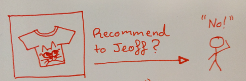
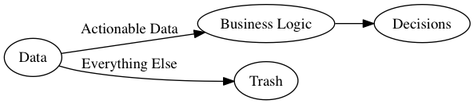
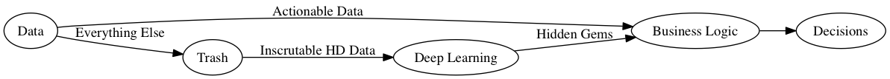

	<em>
		<a href="https://www.flickr.com/photos/fdecomite/">fdecomite</a> -
		<a href="https://www.flickr.com/photos/fdecomite/1603420369/in/photolist-3rFX1M-ncdh5w-7qFds9-7qFmro-7qGjeb-7qFe5S-7qGqU3-7qBr5a-41oeXm-7qG8G7-7qFi93-7qBBsX-pZ3KSV-7qBigK-7qBLMx-7qBpPa-cYNhLE-7qFboU-pt9t7-7qCxYF-pt9rb-7qGu3Q-8cHUQj-7qFxjU-7qBoja-8iurgh-7qGhYm-8irc6n-61nsRn-8iuqNA-5xuZ1e-c53udW-4yuBvF-6htW72-pt9uT-6XwGHU-52kvK3-7DfTdW-4yuAbD-7qCyJn-7qBiS4-7qGhMN-pWXgCG-ucbuf-avJWBr-8iur81-7qBqvg-7qBBEi-ea9aV-7qCbuK">"Gems VI"</a>
	</em>

Businesses commonly have to make recommendations to their customers. These
recommendations can be for products, pages, actions, partners, or many other
aspects of their ecosystems.  While it's easy to dip your toes into making
recommendations, you quickly hit a wall with regards to their effectiveness,
nuance, and sparsity.

<!--more-->

<!--  -->

<!-- https://www.flickr.com/photos/iannnnn/6225517096/in/photolist-au8pkE-ob1jpZ-9QPKCC-4zhH6b-4rv8Zp-aW8P62-nBcrV-dwYiiK-4ySf31-afQQ2-KdRsm-5Hbrgk-2jrW3o-5oSQvC-aVdVmn-7hxNu-oLusSk-mCx8K-b7GeF6-se2J7p-f3eXx-561TCd-4CSXGA-aUGSN4-aUHDmz-3V9fwH-9ffsjP-c8V6e5-LxXA-qnSnwB-FGeKe-69APtX-7YMtxL-fEnxBt-8HaSQB-7pdFQo-6aewrG-Eugpm-7VzMVS-7ZnzQ5-55WGKn-9c6rNm-8CbVGm-FhP1i-82q47x-8fUd6e-h6wm8-8Hb6tB-9eARj3-YDVsB -->

Part of the reason for this is due to the accessibility of the features of data
that companies keep. For example, a t-shirt selling company may want to
recommend t-shirts to customers, however, they can only access limited
information about their t-shirts:

	current_tshirt: {
		image: "pond_hand.jpg",
		size: "Medium",
		sales: 1000 }

And similarly, only simple information about their customers:

	current_customer: {
		name: "Jeff",
		size: "Medium",
		past_sales_ids: [ 12345, 12347, 12348, ] }

Information about a customer's amenability to future recommendations is
highly coupled to information that can be extracted from other products
they have looked at in the past.  This situation leads to great recommendations
for very popular items that have been tagged accurately with metadata, but
there are almost certainly "hidden gems" in the alternatives that lie there,
inscrutable.

While we bemoan the meagre information we have about the unseen items in our
catalog, a lack of data isn't strictly true...

	current_tshirt: {
		image: "pond_hand.jpg",
		image_pixel_one:   "Beige",
		image_pixel_two:   "Red",
		image_pixel_three: "Red",
		image_pixel_four:  "Blue",
		...
		size: "Medium",
		sales: 1000 }

The problem isn't that there is too little data. The problems is that
there is actually too-much _uninterpretable_ data.
What we would love is a function that would allow us to crunch our
opaque data into a more meaningful form:

	current_tshirt: {
		image: "pond_hand.jpg",
		category: "animals",
		hipsterness: "high",
		liked_by: "students",
		art_style: "line drawing"
		...
		size: "Medium",
		sales: 1000 }

If we had such a function, not only could we automatically tag
all of our catalog with useful metadata, but we could simultaneously
build much more useful models of our customers - inferring a great many more
actionable recommendations from their profile and history based
on the additional nuances of the products that they have purchased
or browsed.

We want to take high-dimensional, intractable data:

<!--

digraph {
	rankdir=LR;
	data [label="Data"];
	bl [label="Business Logic"];
	dec [label="Decisions"];
	trash [label="Trash"];
	data -> bl [label="Actionable Data"];
	bl -> dec;
	data -> trash [label="Everything Else"];
}

-->

... and transform it into low-dimensional, actionable data:

<!--

digraph {
	rankdir=LR;
	data [label="Data"];
	bl [label="Business Logic"];
	dl [label="Deep Learning"];
	dec [label="Decisions"];
	trash [label="Trash"];
	data -> bl [label="Actionable Data"];
	bl -> dec;
	data -> trash [label="Everything Else"];
	trash -> dl [label="Inscrutable HD Data"];
	dl -> bl [label="Hidden Gems"];
}

-->

Deep Learning is one approach that can be taken to mining hidden gems.
The beauty of using deep learning is that the solution is so general.
While enough domain-knowledge is required to determine if outcomes are
effective, far-less is needed with regards to designing an algorithm
to perform the task. The application of deep learning to this task
can be done by experts in machine learning, who don't necessarily have
an understanding of your business.

If you're still skeptical about the utility of mining hidden gems,
then take a look at the [Netflix Prize](https://en.wikipedia.org/wiki/Netflix_Prize).
Netflix was awarding one million dollars for a better recommendation
algorithm - and they actually had great metadata, and were already
doing a reasonable job! Imagine how much more of an impact hidden
gems could make in a business where metadata is scarce
and recommendations constricted.

Of course there are pitfalls to be avoided when taking this route. It
is important that, while the neural network tasked with mining hidden
gems needn't know about your business, its mistakes and victories must
be able to be analysed in the context of business needs and rules.
It is also very useful to be able to use deep learning as an engine for
generating fresh insight into your business. The black-box of deep learning
must be cracked open, or at least made translucent to achieve these
goals.

Sadly though, this post has reached its conclusion, and the interoperability of
deep networks is a topic for another day.
