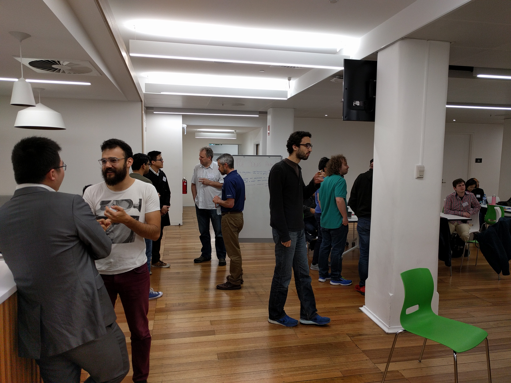
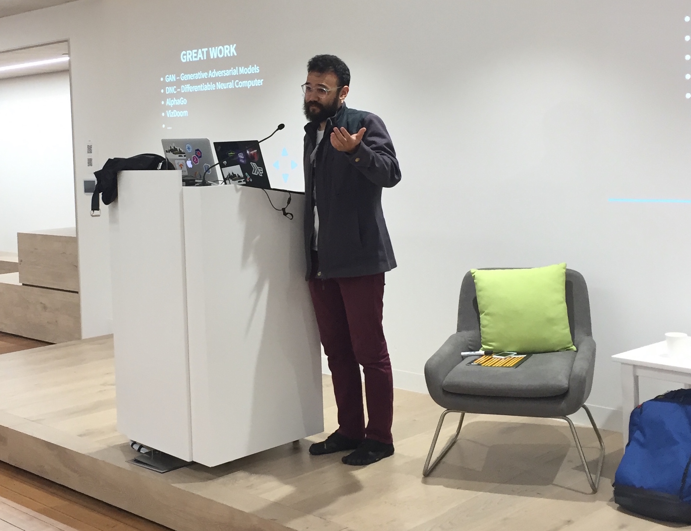
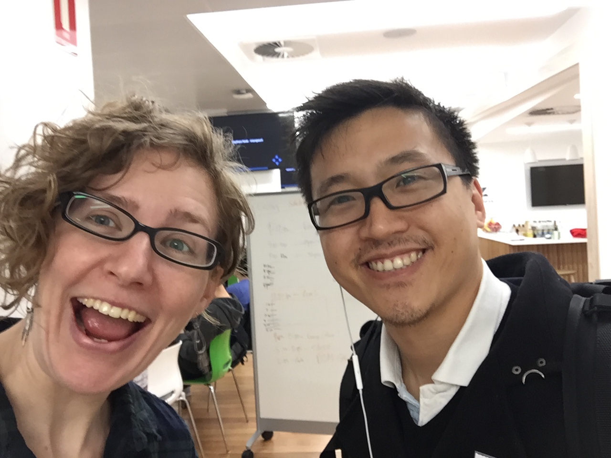
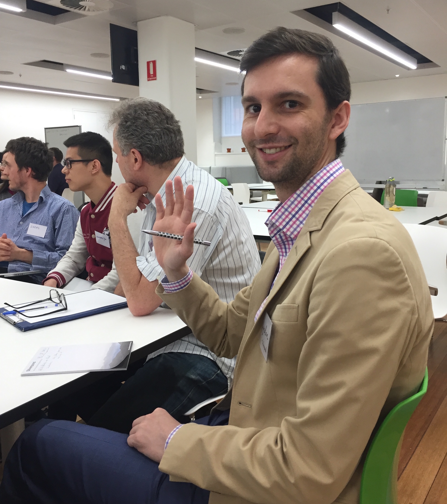
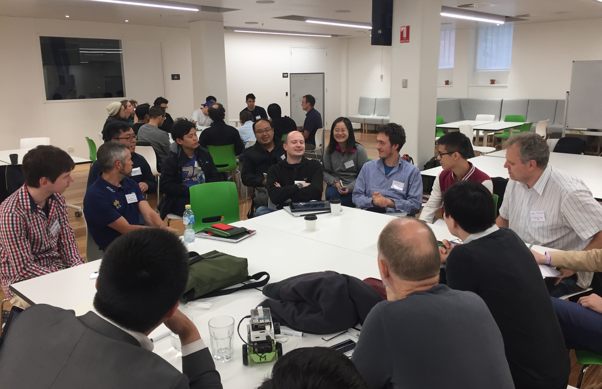
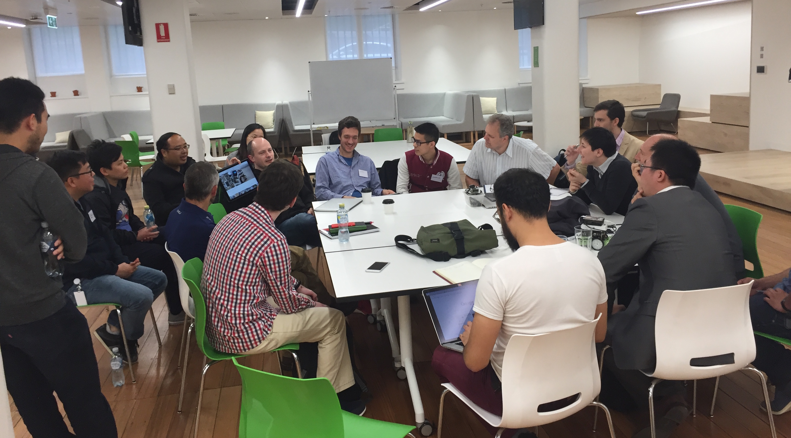
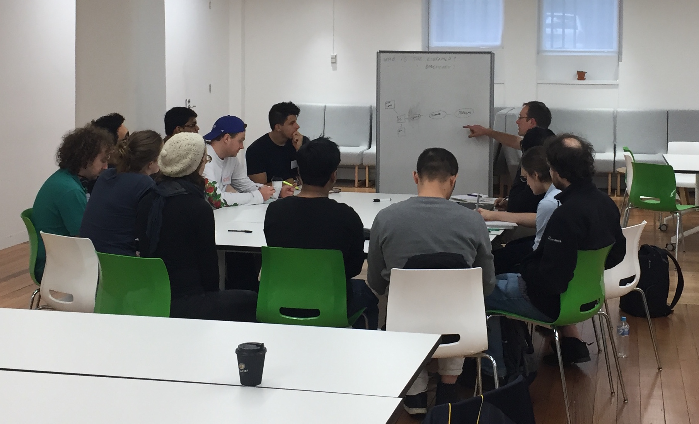

Silverpond recently organised the Machine Learning Unconference intended
to gather Melbourne's leaders and practitioners of AI and machine learning
in order to discuss their pain-points and what might be in store
for the future. The event spanned a day in the
[unconference format](https://en.wikipedia.org/wiki/Unconference) and ended with a panel
discussion, summarising the topics covered and disseminating the ideas
from each track to the entire audience.

<!--more-->

The topics that were tabled by the attendees were:

* What Can ML/DL Do? What Should ML/DL Do?
* AI &amp; Robotics <!-- (Summarised by Andy K) -->
* Machine Learning - Who is the Beneficiary? <!-- (Summarised by Noon) -->
* GANs <!-- (Summarised by Aiden) -->
* Engineering ML Products <!-- (Summarised by Paul) -->
* Hiring Data Scientists <!-- (Summarised by Jono) -->
* Privacy <!-- (Summarised by Liam) -->
* Training for Machines and Newcomers <!-- (Summarised by Andy G) -->

The unconference was hosted at ZenDesk - Who are doing interesting
things in the machine learning space. Data Science Melbourne also
invited attendees to the charity gala dinner that they
were holding that evening.

As part of the event we expressed a desire to facilitate an ongoing forum
for the discussion of the issues facing our community in Melbourne.
We encouraged attendees to join the [Machine Learning & AI Meetup](https://www.meetup.com/Machine-Learning-AI-Meetup/),
and Andy launched the new [melbourne.ai](http://melbourne.ai) - with more news
coming soon.

It was great to discuss candidly, the current issues and opportunities in 
machine learning and AI on the ground. Thanks to ZenDesk,  Data Science Melbourne 
and all the attendees for contributing to a successful Deep Learning Unconference.
