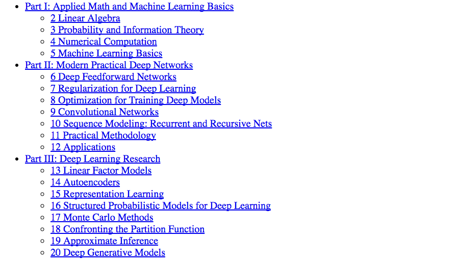

Last Friday, the Deep-Learning Reading-Group who meet at Silverpond
weekly to present and discuss chapters from papers and publications
reached the end our our deep-dive into "The Deep-Learning Book" by
Ian Goodfellow, Yoshua Bengio, and Aaron Courville. The journey has
taken us 6 months and seemed like an ambitious commitment when it
was first proposed, but has been an invaluable introduction to the
subject of deep-learning for myself, and I'm sure, a few others who
have attended as well.

<!--more-->

Section-two of the book concludes with the penultimate paragraph:

> Deep learning has been applied to many other applications besides the
> ones described here, and will surely be applied to even more after this
> writing. It would be impossible to describe anything remotely resembling a
> comprehensive coverage of such a topic. This survey provides a representative
> sample of what is possible as of this writing.

I couldn't help but laugh as I read this, since if what we had covered for
the last half a year of meetings wasn't a comprehensive coverage, then woe
unto anyone who wants to gain such a thing! Haha! That being said, the field
of deep-learning is under constant assult from good ideas, and hoping to
provide a survey of the forefront of deep-learning is surely a hopeless
endevour. Seemingly the only way to stay abreast of developments is to subscribe
to researchers involved in the scene and read as many papers as you can stand.
The approach taken by The Deep Learning Book, then, seems to posess far more
longevity. Attempting not to survey the front-lines, but instead, the foundations,
beginnings, and motivations of the subject.

If not for the lack of exercises, this book would be a formidable introduction
to the subject of deep-learning; Possibly even more than an introduction - Many
digressions into related research and theory abound, providiing a great-deal
of entertainment, but also offering distractions if one's goal is to acquire
a speedy understanding of the topic. The impact of these distractions is
amplified by a lack of warnings about the aside that is iminent. Often you
will only understand that the content was not critical until you've progressed
past it, having taken significant time and mental effort.

Another drawback of the book is that it seems to be pitched at quite a small
audience of people who already have a strong understanding of both math and
software. If not for the companions I had with me during the course of reading,
I'm sure that I would have become frustrated by theory and notation many times
and I couldn't say for sure that I would have stuck with the book. A
reading-group is the ideal way to work through this offering.

All-in-all, The Deep-Learning Book is a heroic tome that was obviously crafted
with great enthusiasm by its authors and has easily earned its place on the
Silverpond bookshelf. It is not an easily digested piece of writing,
nor is it sufficient to gain an up-to-date, working understanding of the
field - Still, I do recommend it.
