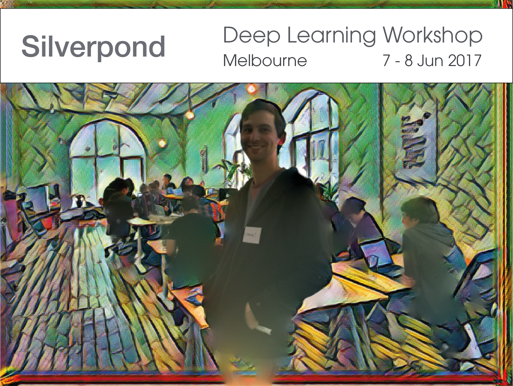

</a>

Venture into deep learning with this 2-day workshop that will take you from
the mathematical and theoretical foundations to building models and neural
networks in TensorFlow. You will apply as you learn, working on exercises
throughout the workshop. The second day will see attendees team up and build a
model (or two!) together in TensorFlow. The group will meet again in a few
weeks for a ["show and tell"](#ShowTell),
where attendees can share their deep learning developments.

This hands-on workshop is ideal for both data science and programming
professionals, who are interested in learning the basics of deep learning and
embarking on their first project.

### We'll cover:

- Machine learning fundamentals
- Building models in TFLearn/TensorFlow (with Python)
- Representation Learning/Word Embeddings
- Convolutions/Pooling
- Solving a simple neural network by hand to consolidate knowledge
- Hands-on exercises in a collaborative environment 
- Using TensorFlow as a general computation engine

### Breakdown:

Here's what the days will look like:

- Day 1 - Fundamentals, Convolutions, Embeddings, Exercises.

The first day will see us learn as a group, working through exercises and
building up a solid base of knowledge around deep learning.

We will cover key concepts in the field and introduce them with examples.

- Day 2 - Group projects.

The second day will see us consolidate our knowledge by working in small
groups on complete projects. A few project options will be provided across
image processing, natural language processing (NLP), and generative models.

This day will build real-world experience in deep learning model development.

### Outcomes include:

* An intuitive understanding of the components of machine learning systems
* Experience building neural networks in TensorFlow and TFLearn
* Clear understanding of convolutions and representation learning
* Experimenting with a model that learns <em>representations</em> of words
* Practical real-world model development in TensorFlow

### You have:

- A laptop that can connect to the internet
- Basic [Python](https://www.python.org/about/gettingstarted/) skills, 
- A willingness to learn mathematics
 
Note: This workshop will  *not* require any setup - each attendee will be
working in an pre-setup environment.

### Workshop reviews 

> "I highly recommend this workshop to anyone who is looking for a solid
> introduction to Deep Learning including its applications and where it fits in
> the AI landscape. The mix of hands-on and presented material was very well
> balanced and blended. The workshop atmosphere was both convivial and conducive
> to learning." - **Robin** - Data Analyst at the Department of Health and
> Human Services.

> "Silverpond's deep learning workshop is a very thought out and fairly
> balanced exercise of theory and practical training useful for anyone trying
> to decipher the landscape of deep leaning." -- **Rohit** -
> [Savvi](http://www.savvi.io/)

> As the top "deep learningers" in the town, the organisers have profound
> knowledge and experience. They are also active in sharing their knowledge and getting
> more people interested. Their lecture notes are fascinating and can engage
> audiences of all levels. If you ever got buzzed by "deep learning", here's
> where you should go. -- **Fei** - Data Scientist at [Kalido](http://www.kalido.com.au)

> "I found this a fun introduction to deep learning fundamentals, tensorflow 
> toolkit and how it can be applied to real world situations. Sometimes you just 
> need a bit of a bootstrap to get your going with an emerging technology, and this
> course does just that." -- **Maree** - Software Developer at the [Bureau of
Meteorology](http://www.bom.gov.au/)
